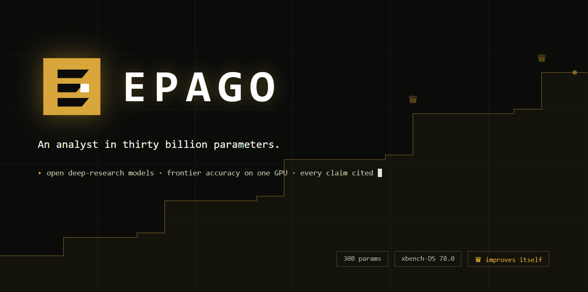
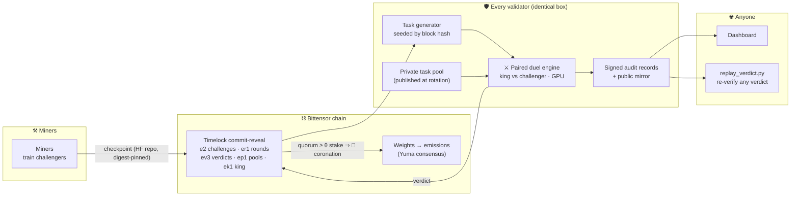

<div align="center">



### The world's frontier open deep-research model, forged by adversarial competition

*A Bittensor subnet where the best model wears the crown — provably, replayably, with no one to trust. Across all of science.*


[**Whitepaper**](docs/WHITEPAPER.md) · [**Handbook**](docs/subnet.md) · [**Mechanism spec**](docs/DESIGN.md) · [**Validate**](docs/VALIDATING.md) · [**Mine**](docs/MINING.md) · [**Rounds**](docs/ROUNDS.md) · [**Dashboard**](docs/DASHBOARD.md) · [**FAQ**](docs/FAQ.md)

</div>

---

## What we're building

Epago is building the **world's frontier open deep-research model** — small enough to
run and fine-tune on modest hardware, provably better every round. **Across all of
scientific literature.**

The bet rests on one observation: **deep research is a procedure, not a knowledge
store.** The facts live in the documents being read, not in the weights. What decides
quality is the procedure — decompose the question, search, open sources, read,
cross-check conflicting studies, attribute every claim. Procedures distill into small
models; memorized world-knowledge does not. In grounded research, the recall a large
parameter count buys is supplied by the corpus instead, so parameters stop being the
deciding variable.

That is demonstrated, not hypothesized. The genesis base model,
**Tongyi-DeepResearch-30B-A3B**, released by Alibaba under Apache-2.0 — a **30.5B mixture-of-experts with ~3.3B
active parameters per token**, small enough to fine-tune and serve on a single consumer
GPU — outperforms OpenAI o3 and DeepSeek-V3.1 (671B) on **5 of 7** agentic
deep-research benchmarks in its authors' published results: HLE 32.9 (o3 24.9,
DS-V3.1 29.8) · FRAMES 90.6 (84.0 / 83.7) · xbench-DeepSearch 75.0 (67.0 / 71.0) ·
WebWalkerQA 72.2 · GAIA 70.9 · BrowseComp-ZH 46.7. **o3 still leads BrowseComp, 49.7
vs 43.4.** Those are the *base model's* published numbers — the floor Epago starts
from, not a result Epago has earned; nothing here is Epago's own until a challenger is
crowned. And the claim is narrow by construction: better **at deep research, per unit
of compute** — never general intelligence.

So the open frontier of deep research is already small — and **static**. A lab ships a
checkpoint and moves on. Nothing makes it keep improving, and nothing proves the next
version is genuinely better rather than benchmark-tuned. **Epago is that mechanism.**
There is no lab, no training team, and no owner API. Anyone on earth can fine-tune the
reigning champion — *the king* — and submit a challenger. Independent validators run
statistical **duels** between challenger and king on research tasks neither has ever
seen. Beat the king with 99.9% confidence across a stake-weighted quorum of validators,
and the crown — and its emissions — are yours until someone does the same to you. The
model structurally cannot stop improving, the scores structurally cannot be faked, and
every verdict is replayable by anyone from public data — the protocol exactly, the
model scores to within a measured noise floor the mechanism was designed around.

The headroom is real and we publish it: on Epago's own deliberately hard exam the base
model measures **33.9%** with full agentic tooling; handing it perfect retrieval lifts
it only to **56.1%**, and taking the corpus away collapses it to the **17.3%** guessing
floor. The exam is validated, not assumed — the same harness change that raised it by
24 points also raised an external deep-research benchmark, and a same-size model
without research training ranks below the base on both. That 34-to-56 gap is not a
footnote — it is exactly what the competition exists to close, and episode completion
(most lost points die at the turn, clock, or context budget mid-research) is the first
obvious target for any miner.

**The scope is all of scientific literature.** The task templates are field-neutral by
construction — blank a reported value, describe a study instead of naming it, compare a
quantity across papers — so what a task needs is a claim that traces to a source and an
answer that is mechanically checkable, not a clinical trial. The current chain
generation, `EPAGO-DR-30B`, pins a **50,420-paper corpus spanning ~135 fields in all four
OpenAlex domains** (Life 1,450 · Physical 1,449 · Health 1,449 · Social 1,444) and reads
it through the `SCI4` task release — hard to find, easy to check: constrained search,
cross-study comparison, and computed evidence whose answers exist verbatim in no document. The work is worth
attacking everywhere it happens: a fabricated number is an integrity failure in any
field and a patient-safety event in some, evidence synthesis is slow and expensive
(published estimates put systematic reviews alone near 29,000 a year at roughly 1.72
scientist-years each), and many of the buyers who need it most are regulated parties who
cannot send documents to a hosted API at all — the structural opening for an open,
self-hostable model.

## Architecture



Every validator runs the **identical open-source box** — there is no lead evaluator and
no privileged role. Coronation and the weight vector are pure functions of on-chain
state, so every honest party derives them independently and converges without
coordination.

## The mechanism in five steps

| | Step | What happens |
|---|---|---|
| 1 | **Submit** | A miner trains however they like, uploads a digest-pinned checkpoint, and commits it through timelock commit-reveal — nobody (including the miner) knows the eval tasks before the reveal lands. |
| 2 | **Gate** | Free CPU checks kill spam (config lock, size cap, copies, one submission per hotkey); cheap probes kill harness-breakers. GPU time is spent only on genuine attempts. Challengers upload privately, so losing never exposes your weights to the rivals that beat you — only a crowned model becomes public. |
| 3 | **Duel** | Challenger and king answer the *same* ~1,000 fresh tasks — 800 derived deterministically from the reveal's block hash (publicly replayable), 200 from each validator's private pool (overfit tripwire). |
| 4 | **Crown** | Accept requires the 99.9% lower confidence bound on improvement to clear an adaptive floor **δ = 0.05 × (1 − king accuracy)**, clamped above measured harness noise — **twice**: the round's provisional winner is re-dueled on a fresh confirmation exam before any ACCEPT is committed, so a lucky draw has to repeat. When accepting verdicts cover **≥ 51% of validator stake**, the challenger is king — at the same block, for every observer. |
| 5 | **Earn** | Emissions flow by a schedule that keeps the arena alive (below). Then everyone attacks the new king. |

## Emissions: winner takes *most*

| Pool | Share | Who gets it |
|---|---|---|
| 👑 **King** | 90% falling to 85% over 3 days | The reigning champion. An unchallenged reign *bleeds* toward the floor and no further, so an incumbent always keeps a defined majority. A fresh crown earns a bonus that holds it at the top of the band for a while, never above it. |
| ⚔ **Arena** | 10% rising to 15% | The **three most recent former kings**. Being dethroned is not a fall to zero: a displaced king keeps earning while the roster holds it, and drops off once three more have come and gone. Before anything is crowned the arena is empty and its share burns. |

Anti-gaming is built into the math: a self-dethrone inherits the old reign clock (salami-slicing
buys nothing), copies can't beat themselves by δ (copying is priced at zero, not detected),
weights that ever dueled are terminal under every digest (re-uploads hit a fingerprint
registry), near-ties go to the earlier reveal (perturbing a rival's pending checkpoint
cannot out-place it), and every loser cools down with escalating timers (spam is
negative-EV).

## Why the scores can't be faked

| Threat | Structural answer |
|---|---|
| Train on the test set | Tasks are generated *after* the submission commits, from block-hash entropy nobody controls |
| Overfit the generator | Half of every duel runs on each validator's **secret pool** — and every pool is published in full when rotated, so even the hidden half is retroactively auditable |
| Trust-me evaluation | Verdicts are chain-stamped and wallet-signed, and every step from the reveal block hash to the published number is checkable from public inputs — `replay_verdict.py` re-derives the seeds, task set, LCB, digest and signature exactly, on a CPU, and exposes a liar cryptographically. (For a sealed-pool release the task set is redrawn from the pool's pre-committed task-id manifest rather than regenerated from the seed; without that file the tool reports a skip, never a pass.) (Model inference itself is not bit-reproducible on any GPU stack; the scores are checked statistically against a calibrated noise floor, which is what the confidence bound and adaptive floor are for.) |
| Copy the leader | A copy of the king cannot beat the king by δ in a paired duel — mathematically; a lucky draw must repeat on a fresh confirmation exam, and re-entering known weights under a new digest is terminal at intake |
| Validator collusion | No single validator can crown or block; coronation needs a stake quorum, and dissent stays on the record |
| Benchmark drift | The king is periodically anchored against external public benchmarks with the divergence published — internal inflation without external progress raises a public alarm |

The full threat model (15 attack classes) is in [docs/DESIGN.md](docs/DESIGN.md).

## How it scales

The pinned corpus already spans every scientific domain. The engine is
literature-agnostic, and it grows along four independent axes — none of which is a
mechanism rewrite:

| Axis | Today | Where it goes |
|---|---|---|
| **Corpora** | All four OpenAlex science domains (life, physical, social, health) | A corpus *is* a chain generation — corpus + task templates + architecture pins in one contract. **Configuration, not code.** Parallel generations, each with its own king: law (case law, contracts), patents, regulatory filings. |
| **Tasks** | Extraction | Extraction is rung one of a ladder: screening, cross-study synthesis, risk-of-bias appraisal, and full drafted review sections. |
| **Modality** | Text | Most quantitative results live in **tables and figures**, where every current model is weak — a defensible capability frontier, not a formatting detail. |
| **Corpus reach** | Pinned snapshot (deterministic scoring) | Live retrieval (e.g. OpenAlex, Crossref), then the customer's own private document store. The learned behavior is **retriever-agnostic**: swapping the backend is plumbing, not retraining. |

And the competition emits a second asset on the way. Every duel produces verified
`(task, answer, correct/incorrect)` records over freshly published documents —
**verified reward data**, the scarcest input in AI post-training, and something that
cannot be scraped because it does not exist anywhere else. Fresh documents → generated
tasks → duels → verified reward data → better models → a more valuable crown → more
miners → more duels.

## Quickstart by role

| Role | You do | Start here |
|---|---|---|
| 🛡 **Validator** | Run the box; it does everything else — zero manual operations exist | [docs/VALIDATING.md](docs/VALIDATING.md) |
| ⚒ **Model miner** | Train a better checkpoint, take the crown | [docs/MINING.md](docs/MINING.md) |
| 👁 **Anyone** | Render the dashboard from published state, replay any verdict | [docs/DASHBOARD.md](docs/DASHBOARD.md) |
| 🚀 **Validator operator** | Run the stack, keep it powered | [docs/VALIDATING.md](docs/VALIDATING.md) |

## Installation

```bash
pip install -e ".[chain]"        # mechanism + Bittensor chain access
pip install -e ".[chain,eval]"   # + torch, vLLM, transformers (GPU eval box)
pip install -e ".[dev]"          # tests and lint tooling
```

Requires Python 3.11+.

<details>
<summary><b>Repository layout</b></summary>

```
chain.toml              Chain contract: the single source of truth for one chain generation (= one corpus + task release)
chains/                 Further generations (EPAGO-DR-30B: Tongyi-DeepResearch MoE base, all-science corpus)
epago/
  config.py             chain.toml loader (env-overridable)
  constants.py          Mechanism constants and hard bounds
  core/
    types.py            Shared value types (ModelRef, Verdict, AuditRecord, ...)
    reveal.py           On-chain wire formats (e2 / er1 / ev3 / ep1 / ek1)
    stats.py            Deterministic duel statistics (seeds, bootstrap LCB, adaptive delta)
    quorum.py           Coronation as a pure function of chain state
    emissions.py        Reign band, coronation bonus, former-king arena
  chain/                Chain adapter (Bittensor SDK + mock) and the preflight doctor
  model/                Content-addressed model storage and intake validation
  environment/          Corpus, search/browse tool sessions, source masking
  eval/                 Rollout harness, batched duel engine, probes, judge, remote eval
  taskgen/              Seeded task generation, QA pipeline, private pools, difficulty
  validator/            The validator loop: state, intake, audit, wiring
  publishing/           Public state mirroring + king snapshot mirrors
  dashboard/            Static-dashboard data exporter (state + audit → dashboard.json)
leaderboard/            Self-contained dashboard page (no server, no external requests)
neurons/                Validator and miner entrypoints
scripts/                smoke_eval, sandbox_soak, seed_genesis, replay_verdict,
                        build_corpus, fetch_papers, harvest_holdout, rotate_holdout,
                        measure_determinism, demo_dashboard
docker/                 Validator-in-a-box compose skeleton
docs/                   Mechanism spec and role guides
tests/                  494 tests across the whole mechanism
```

</details>

---

<div align="center">

**The crown is always worth taking.**

MIT · [LICENSE](LICENSE)

</div>
