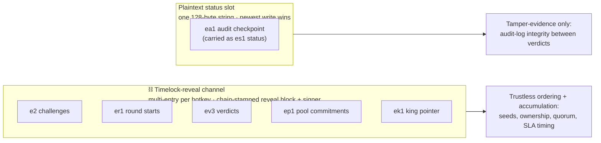

# ⚔ Epago mechanism specification

*The normative spec: every verdict, coronation, and weight vector is a pure function of on-chain state, and every number below is a default from `chain.toml` or `epago/constants.py`.*

**What this mechanism is for.** It produces the world's frontier open deep-research
model — small enough to run and fine-tune on modest hardware, provably better every
round, across all of scientific literature. The premise it is built on is that deep
research is a **procedure, not a knowledge store**: the facts live in the documents
being read, so
parameters stop being the deciding variable and a ~3.3B-active-parameter model (of a
30.5B MoE) can hold the frontier. The published frontier is already there and already
static; everything specified below exists to make it compound instead, with each step
provably better than the last. The pinned duel corpus spans all four OpenAlex science
domains (Life, Physical, Health, Social) and the `SCI4` task release mints from it by one rule — hard to find, easy to check — through a
field-neutral finding vocabulary — nothing in this document is specific to any field.

This document is normative — it describes what the code in `epago/` does, and where
prose and code could ever disagree, the code wins. Every constant is overridable via
`EPAGO_<NAME>` environment variables for testnets and soaks; mainnet uses the
defaults. The chain contract for a generation lives in `chain.toml`; swapping
generations (new base architecture, new corpus) is a new `chain.toml` plus an
architecture shim, never a mechanism rewrite.

**A domain is a generation, and a generation is configuration.** That is the load-bearing
scaling property of this spec: nothing below changes when the subject matter does. Four
axes grow independently of the mechanism —

| Axis | Moves by editing | Mechanism impact |
|---|---|---|
| **Corpus** — all of scientific literature (the four OpenAlex domains) → law (case law, contracts) → patents → regulatory filings; generations run in parallel, each with its own king | a new `chains/*.toml`: `[eval]` corpus pins, task release, `arch.extra_lock_keys` | none |
| **Task ladder** — extraction → screening → cross-study synthesis → risk-of-bias appraisal → drafted review sections | a new `eval.taskgen_release` in `epago/taskgen/` | none; grading stays the §4.0.1 programmatic-first cascade |
| **Modality** — text → tables and figures, where most quantitative results live | task templates + corpus ingestion | none |
| **Corpus reach** — pinned snapshot → live retrieval → customer-private document store | the `Search`/`Browse` backend in `epago/environment/` | the pinned snapshot is required *for scoring* (§4.0.3 determinism), not for deployment; the selected behaviour is retriever-agnostic |

Every duel additionally emits verified reward data as a first-class output; see §8.

Terms used throughout:

| Term | Meaning |
|---|---|
| 👑 **King** | The current champion checkpoint |
| ⚔ **Challenger** | A submitted checkpoint dueling the king |
| 🛡 **Validator** | Runs the full evaluation stack and posts verdicts |
| **Evaluator** | A validator that has posted verdicts recently enough to count toward quorum |

## Lifecycle of a challenge

```mermaid
sequenceDiagram
    autonumber
    participant M as ⚒ Miner
    participant O as 🔑 Round authority
    participant C as ⛓ Chain
    participant V as 🛡 Each validator
    participant P as 🌐 Anyone

    M->>C: commit e2 (timelock, revealed after 5 blocks)
    C-->>V: reveal lands — chain stamps block, block hash, and signing hotkey
    V->>V: scan gates (CPU: ownership, stale parent, hotkey spent, repo name)
    Note over V: queued — nothing is evaluated until a round opens
    O->>C: er1 round start (round authority only, ≥2 days apart)
    C-->>V: trigger lands — its block hash mints the round's exam
    V->>V: pre-duel gates per entrant (hygiene, config lock, size cap, exact copy)
    V->>V: probes (format compliance >=55%, norm sanity)
    V->>V: ⚔ round — the whole field vs the king on 800 public + 200 private tasks
    V->>C: commit one ev3 per entrant; only the best gets ACCEPT
    Note over C: latest-per-validator ACCEPTs reach ≥ 0.51 of active-evaluator stake
    C-->>V: 👑 coronation — same block for every observer
    V->>C: ek1 king pointer (coronation authority only)
    V->>C: weight vector (pure function of chain state)
    V-->>P: signed audit record + mirrors — replayable by anyone
```

The rest of this document specifies each step.

---

## 1. On-chain channels and objects

Two chain-provided channels carry everything, each used strictly for what it
actually guarantees (`epago/chain/client.py`):



- **Timelock-reveal channel** (`set_reveal_commitment` /
  `get_all_revealed_commitments`) — multi-entry per hotkey, every entry
  **chain-stamped with its reveal block and its signing hotkey**. Everything that
  must accumulate or be trustlessly ordered flows here: miner `e2` challenges,
  `er1` round starts, validator `ev3` verdicts, `ep1` private-pool commitments,
  and `ek1` king pointers. Because the reveal block is stamped by the chain, a validator cannot backdate or
  forward-date a verdict and a miner cannot choose the block hash that seeds its
  duel. Because the **signer** is stamped by the chain, no payload needs to —
  or is permitted to — carry its own claim of authorship.
- **Plaintext status slot** (`set_commitment` / `get_all_commitments`) — ONE string
  per hotkey, hard-capped at 128 bytes, newest write wins. Only the compact `ea1`
  audit checkpoint lives here (carried as the validator's `es1` status). Nothing
  consensus-critical is allowed in an overwritable slot.

All payloads are versioned; payloads with unknown versions are dropped at intake
with a one-time warning, never errors (`epago/core/reveal.py`).

### 1.1 `e2` — challenge reveal (timelock channel)

Submitted by model miners through the timelock commit-reveal extrinsic
(`BLOCKS_UNTIL_REVEAL = 5` blocks between commit and automatic reveal):

```
e2|<king_digest>|<challenger_repo>|<challenger_digest>
```

| Field | Meaning |
|---|---|
| `king_digest` | The digest of the king this challenger was trained against. A reveal whose `king_digest` no longer matches the reigning king is dropped as `stale_parent`. |
| `challenger_repo` / `challenger_digest` | A content-addressed model reference. `hf:<40 hex>` is a public Hugging Face revision; `sha256:<64 hex>` is a private upload in the validator's object store, under `submissions/<author hotkey>/`. The digest is the binding commitment either way: evaluation materializes exactly the committed snapshot. The two are checked for ownership differently — a public ref by repository name, a private one by key prefix — because a private upload has no owner field, only a prefix its credential is confined to. |

**The author is not on the wire.** It is the hotkey the chain recorded as
signing the commitment. The retired `e1` format carried an `author_hotkey`
field that nothing verified, and intake keys digest ownership, the one-per-hotkey
rule, self-challenge, the repo-prefix check, the duel seed *and* emission
attribution off authorship — so any registered hotkey could submit a
deliberately losing checkpoint declaring a rival as author and spend the
rival's hotkey for the price of one UID, permanently. The `hotkey_prefix` gate did not help: it
compared the repo name against the *declared* author, so the attacker simply
named its repo after the victim. `e1` payloads no longer parse.

Latest reveal per hotkey wins; earlier reveals from the same hotkey are
superseded. Supersession is resolved over the **whole reveal history**, not
over the window since the validator last polled — otherwise a box that had just
restarted and a box ticking steadily would admit different challenges from
identical chain state. The block hash at the reveal block
(`block_hash_at_reveal`) seeds the duel (§4.2).

### 1.2 `ep1` — private-pool commitment (timelock channel)

| Format | Purpose |
|---|---|
| `ep1\|<epoch>\|<digest16>` | Each validator's commitment to the private-pool epoch that is **about to become active**, published before that pool grades a single duel. No duel runs while the active epoch is uncommitted. The chain stamp makes it impossible to retro-fit a pool to already-known duel outcomes. |

### 1.3 `er1` — round start (timelock channel)

Published by the **round authority** — the hotkey named in
`chain.round_authority_hotkey`:

```
er1|<round>
```

The round number is the only field. The block and its hash come from the
chain's own stamp, so the authority can neither backdate a round nor choose the
entropy that mints its exam.

**Nothing is evaluated until one of these lands.** Submissions are accepted
continuously and queue up, but no duel runs, no verdict is committed and no
coronation happens until the authority opens a competition. Every validator
enforces two rules on top of the authority check, so the schedule is a property
of the chain rather than of how often the owner runs the command:

| Rule | Why |
|---|---|
| Round numbers strictly increase | A replayed number cannot re-run a competition. |
| ≥ `ROUND_MIN_INTERVAL_BLOCKS` (14400, ~2 days) between starts | Without it the authority could run rounds back to back and hand a favoured miner as many exam draws as it liked. |

> **This is a privileged role and a liveness dependency.** It reverses R1 ("no
> owner API, no privileged operator") and R2 ("zero human-intervention paths").
> Whoever holds the key can stop the subnet improving by declining to open a
> round, and there is no fallback that starts one without them. That is a
> deliberate product decision, not an oversight — but the threat model in §10
> no longer covers a hostile or absent authority, and the "fully decentralized"
> claim does not hold while this is enabled. Setting the hotkey to empty
> disables rounds entirely rather than reverting to continuous evaluation.

### 1.4 `ev3` — verdict commitment (timelock channel)

Published by validators after finishing a duel, through the same timelock-reveal
channel (`VERDICT_REVEAL_BLOCKS = 5`). The verdict's block — the one quorum
ordering and SLA measurement use — is the **chain's reveal stamp**, never a
self-reported field:

```
ev3|<challenger_digest>|<A|R>|<lcb_pub_e6>|<mu_priv_e6>|<delta_e6>|<round>|<priv_epoch>|<audit16>
```

| Field | Meaning |
|---|---|
| `A`/`R` | Accept or reject. |
| `lcb_pub_e6`, `mu_priv_e6` | The public-half lower confidence bound and the private-half mean paired difference, each multiplied by 10^6 and encoded as a signed integer. |
| `delta_e6` | The adaptive floor this duel was judged against (§4.5), same encoding. |
| `round` | The competition this verdict belongs to (§1.3). |
| `priv_epoch` | Which private-pool epoch the private half was drawn from (§7). |
| `audit16` | The first 16 lowercase hex characters of the digest of the full audit record (§8) that produced this verdict. |

`delta_e6` is what makes **near-miss classification chain-derivable**. The floor
is per-validator — it depends on that box's measured noise floor and
king-accuracy EMA — so without it on the wire no other validator could reproduce
the arena split, and any validator that had not run the duel itself computed a
different weight vector for the same chain state.

A rejection is a **near-miss** when `lcb_pub > 0` **and** `mu_priv > 0`. Two
cases qualify, and both are honest attempts the arena pool exists to fund:

* `0 < lcb ≤ delta` — probably better, not provably;
* `lcb > delta` — provably better, but another entrant in the same round was
  better still. A round crowns one winner, so a genuine improver can be
  rejected purely for placing second; penalising it for that would
  punish exactly the behaviour the subnet wants.

`mu_priv > 0` is what separates both from the overfit case: a challenger that
clears the public floor while losing the private half was tuned to the
generator, and that is a plain loss.

Integer fields must be **canonical decimal**: no underscores, leading zeros,
surrounding whitespace, redundant signs, or non-ASCII digits. `int()` accepts
all of those, which would let two byte-different payloads parse to the same
verdict.

Malformed digests, decisions, or audit fields fail parsing and the verdict is
dropped. A validator that re-runs a duel supersedes its own earlier commitment:
quorum counts only the latest verdict per validator per challenger.

### 1.5 `ek1` — king pointer (timelock channel)

Published by the **coronation authority** — the hotkey named in
`chain.king_authority_hotkey` — at every crowning:

```
ek1|<repo>|<digest>|<author_hotkey>|<crowned_block>|<reign_started_block>|<lcb_e6>|<delta_e6>
```

This is what makes a validator startable. Coronation state used to live only in
a validator's local state directory, and a box with an empty one installed the
genesis seed as its king: every live `e2` reveal then failed the `stale_parent`
gate, no duel ever ran, no verdict was ever posted, and the box could never
catch up. That trapped every new validator and any existing one that lost its
state directory. A validator now adopts the authority's pointer, reign clock
included — recomputing the clock locally would restart the reign at adoption
time and hand the incumbent a fresh decay curve on every restart.

Pointers from any hotkey other than the configured authority are ignored, and a
pointer naming an older `crowned_block` than the current king never rolls the
throne backwards.

### 1.6 `ea1` — audit checkpoint (plaintext status slot)

Every `AUDIT_CHAIN_COMMIT_EVERY = 100` audit records, a validator publishes a
checkpoint commitment over its append-only audit log through the single 128-byte
plaintext status slot:

```
ea1|<records_total>|<log_digest>
```

where `records_total` is the number of records in the log and `log_digest` is
`sha256:<64 hex>` over the canonical JSON serialization of the log up to that
record. Overwriting is harmless here because every `ev3` already binds its own
audit record via `audit16`; the `ea1` chain additionally prevents a validator from
silently rewriting history between publications.

---

## 2. Model references and storage

`epago/model/store.py` implements content-addressed storage:

- `hf:` refs pin a Hugging Face revision hash; downloads restrict to
  `*.safetensors`, `*.json`, `*.txt`, `tokenizer*`.
- `sha256:` refs pin a deterministic snapshot digest: SHA-256 over the canonical
  JSON list of sorted `(relative_path, file_sha256)` pairs.
- `materialize_model` is idempotent (a `.epago_verified` marker skips re-download)
  and verifies before marking: a failed verification deletes the snapshot.
- Repos must present the canonical safetensors layout (`model.safetensors` or
  `model.safetensors.index.json`).

Ownership of a digest is adjudicated purely by **on-chain reveal ordering**: the
first hotkey to reveal a digest owns it; later reveals of the same digest are
rejected at intake. No registry timestamps or off-chain oracles are consulted.

---

## 3. Intake gates (in order)

A revealed challenger passes every gate below before any full duel is run. Each
failure is recorded with a machine-readable reason (`epago/model/validation.py`,
`epago/core/types.py::SubmissionStatus`). Miner tooling ships a `preflight`
command that runs the exact same checks locally.

### 3.1 Scan gates — CPU, before the queue

Reveals are processed in on-chain order — `(reveal_block, hotkey)`, hotkey as a
deterministic tie-break — so every validator resolves digest ownership
identically (`epago/validator/intake.py`).

| # | Gate | Rejects when | Failure code |
|---|---|---|---|
| 1 | **Wire format** | The payload does not parse as `e2`, or a digest fails the digest grammar | dropped with a warning |
| 2 | **Supersession** | An older reveal from the same hotkey exists — only the latest per hotkey is considered | superseded silently |
| 3 | **Digest ownership** | The digest was first revealed by a different hotkey (first on-chain reveal owns it) | `duplicate_digest` |
| 4 | **Already resolved** | The digest is the reigning king, already queued, or terminally resolved | skipped |
| 5 | **Stale parent** | `king_digest` does not equal the reigning king's digest | `stale_parent` |
| 6 | **Self-challenge** | The author hotkey already holds the crown | `self_challenge` |
| 7 | **Hotkey spent** | The author *hotkey* has already put a submission into the queue. One per hotkey, permanently — refused here, before the queue | `hotkey_spent` |
| 8 | **Failure memory** | The digest previously failed a deterministic gate — re-revealing an already-failed checkpoint is free to reject | `failure_memory` |
| 9 | **Registration** | The hotkey is not registered on the netuid | `unknown_hotkey` |
| 10 | **Repo name** | The repo does not match `chain.repo_pattern` (`^[^/]+/EPAGO-DR-30B-.+$`), or does not contain the first 8 characters of the author hotkey, case-insensitive (anti-impersonation) | `repo_pattern` / `hotkey_prefix` |

### 3.2 Pre-duel gates — after materialization, still no full duel

| # | Gate | Rejects when | Failure code |
|---|---|---|---|
| 11 | **File hygiene** | Files other than `.safetensors`, `.json`, `.txt`, `.model`, `.jinja`; any `.py` file; pickle-format weights (`.bin`, `.pt`, `.pkl`, `.ckpt`); missing canonical safetensors layout | `FAILED_INTAKE` |
| 12 | **Config lock** | `config.json` differs from the king's on any generic lock key (`architectures`, `vocab_size`, `hidden_size`, `num_hidden_layers`, `num_attention_heads`, `num_key_value_heads`, `head_dim`, `intermediate_size`, `model_type`, `tie_word_embeddings`, `rope_theta`, `max_position_embeddings`) or any of the generation's `arch.extra_lock_keys` (for `EPAGO-DR-30B`: the MoE keys `num_experts`, `num_experts_per_tok`, `moe_intermediate_size`, `decoder_sparse_step`, `norm_topk_prob`, `mlp_only_layers`, `use_qk_norm`, `use_sliding_window`, `sliding_window`, plus `rope_theta`, `rope_scaling`, `tie_word_embeddings`, `max_position_embeddings`); `auto_map` present (there is no remote-code path) | `FAILED_INTAKE` |
| 13 | **Size cap** | Total safetensors bytes > `MAX_CHALLENGER_SIZE_RATIO = 1.05` × the king's | `FAILED_INTAKE` |
| 14 | **Exact copy** | Challenger shards are byte-identical to the king's, per-shard | `exact_copy` |
| 14b | **Known content** | The challenger's weight fingerprint matches weights that already dueled under any digest, in this round or any earlier one — a digest is a revision hash, so the same safetensors re-uploaded or re-sharded mint a fresh digest without being fresh content. Within a round the earlier reveal keeps the slot; across rounds the registry (`seen_fingerprints`, persisted) is terminal and the re-entry cools the submitting hotkey down — a retry must at least be a retrain | `duplicate_weights` |
| 15 | **Format probe** (cheap GPU) | Fewer than `FORMAT_PROBE_MIN_COMPLIANCE = 0.55` of the generations across `FORMAT_PROBE_TASKS = 20` probe rollouts carry a parseable action (the probe set is the low-hop, template-balanced slice of a `FORMAT_PROBE_POOL_TASKS = 100` pool; the criterion is per generation, so a hard task cannot fail it) | `FAILED_PROBES` |
| 16 | **Norm sanity** (cheap GPU) | Per-layer weight-norm ratio vs the king > `NORM_SANITY_MAX_LAYER_RATIO = 20.0`, or global ratio > `NORM_SANITY_MAX_GLOBAL_RATIO = 5.0` (degenerate or smuggled weights) | `FAILED_PROBES` |

Only then does the duel run.

---

## 4. The round

A competition evaluates the **whole queued field at once** against the king, on
**one exam**, and crowns the best entrant.

| Rule | Specification |
|---|---|
| **Trigger** | An `er1` from the round authority (§1.3). Nothing runs without one. |
| **Field** | Every admitted challenge revealed **strictly before** the round-start block, ordered by `(reveal_block, digest)` and capped at `ROUND_MAX_ENTRANTS = 32`. The overflow keeps its place for the next round and the cut is logged, never silent. |
| **Exam** | Minted once from the round-start block hash: `derive_seed(round_block_hash, str(round), b"public")` and the matching `b"private"` seed. Keyed on the round, never on an entrant. |
| **Scoring** | The king answers the exam **once**; its per-task results are reused for every pairing. Each entrant is then scored exactly as a solo duel would score it. |
| **Winner** | The highest `lcb_pub` among entrants that clear both halves — but LCBs within one calibrated noise floor of each other are the same measurement, and inside that band the **earlier reveal** wins (then digest, as the final deterministic tie-break). Reveal order is what makes copying a pending rival's checkpoint strictly worse than being the rival: a perturbed copy cannot out-score its source beyond noise, and inside noise it now always loses. Exactly one `ACCEPT` verdict is committed per round. |
| **Confirmation** | The provisional winner is re-dueled once (`CORONATION_CONFIRMATION_DUELS = 1`) on a **fresh** exam — `b"confirm-public"` / `b"confirm-private"` seeds from the same round block hash — and must clear the floor again before its `ACCEPT` is committed. One 99.9% clear is one lottery ticket; requiring two independent clears squares the false-crown probability, so a fleet of lucky noise-copies stays harmless without raising the bar a genuinely better model must beat. An unconfirmed winner settles as a near-miss; a confirmation that cannot be minted or run also demotes, never crowns. The outcome is pinned in the round's audit record (`confirmation` block). |
| **Everyone else** | Rejected. Runners-up that beat the king are near-misses (§1.4) — one re-duel on a fresh exam, no emission. Every entrant's hotkey is spent either way. |
| **Forfeit** | An entrant whose sweep cannot run at all is scored `lcb = −1` rather than skipped, so a checkpoint that reliably crashes the harness spends its hotkey like any other submission instead of occupying a slot in every round for free. |

Two properties follow from minting the exam once per round rather than once per
submission:

* **Rivals are compared without exam luck.** Under a per-submission exam two
  challengers of equal skill could be separated purely by which questions each
  happened to draw; here the only thing that differs between them is their own
  output.
* **A large field is affordable.** N entrants cost N+1 sweeps, not 2N.

The freshness property is unchanged and rests on ordering: the trigger is
published *after* every entrant's weights are already committed, so nobody —
including the authority — can know the questions while a checkpoint can still
be changed. That is also why a reveal landing at or after the round-start block
is excluded: it has already seen the hash.

### 4.0 The paired duel

#### 4.0.1 Rollouts

Both models attempt each task inside the pinned research environment: a SQLite
full-text-search corpus with `<search>` / `<browse>` tool turns and a final
`<answer>`. Every knob the harness can pin is pinned (the engine's own arithmetic is
not one of them — see §4.0.6):

| Harness pin | Value |
|---|---|
| Decoding | Greedy — `temperature = 0`, `seed = 42` |
| Turn cap | `ROLLOUT_MAX_TURNS = 40` |
| Wall-clock cap | `ROLLOUT_TIMEOUT_S = 300` seconds |
| Context | `ROLLOUT_CONTEXT_TOKENS = 32768` tokens |
| Answer cap | `ANSWER_MAX_CHARS = 200` characters |

Each task's `masked_doc_ids` are removed from search and browse for its rollouts,
so answers must be re-derived, not looked up at their origin.

Grading is **programmatic-first**: normalized exact match, then alias match, then —
only as a narrow fallback — a pinned, digest-committed judge model with sanitized
inputs. Every audit record publishes its `judge_invocation_rate`; a rising rate is
a taskgen defect signal consumed by the difficulty controller, not an operator
page.

#### 4.0.2 Seeds (deterministic, public)

From `epago/core/stats.py`, all randomness derives from public chain inputs:

```
derive_seed(block_hash, hotkey, label) =
    int.from_bytes(blake2b(block_hash || hotkey || label, digest_size=8), "big")
```

with domain-separating labels `b"public"` (public task selection), `b"private"`
(private-pool sampling), and `b"boot"` (bootstrap resampling). `block_hash` is the
block hash at the challenge's reveal block; `hotkey` is the challenger author's
hotkey. Two validators — or a validator and an auditor years later — compute
bit-identical seeds, task selections, and bootstrap draws from the same chain data.

#### 4.0.3 Halves

| Half | Tasks | Source | Job |
|---|---|---|---|
| **Public** | `N_PUB_TASKS = 800` | Selected by the public seed, either from the deterministic generator pinned by (`eval.corpus_digest`, `eval.taskgen_release`) or from a sealed pool when the release names one (§4.0.4); byte-identical across all validators either way | The replayable backbone; carries the statistical bar |
| **Private** | `N_PRIV_TASKS = 200` | Drawn from the validator's own private pool (§7) | Breaks generator overfitting; its gate is deliberately lenient — it is not a second significance test |

#### 4.0.4 Sealed public pools

A release whose name begins with `POOL` serves its public half from a pre-minted
file instead of a generator. This exists because the task families worth asking
are worded by a language model, and no promise about temperature survives a
provider changing hardware or model version — so those tasks cannot be a pure
function of a seed the way template-generated ones are.

What the protocol actually needs is narrower than "regenerable": the exam must
not be knowable before a model is frozen, and a verdict must be checkable
afterwards. A generator gives both by construction. A sealed pool gives both by
sequencing, using three artifacts:

| Artifact | Contents | When it publishes | Pinned by |
|---|---|---|---|
| **Pool** | every minted task, with answers | when the pool retires | `eval.public_pool_digest` |
| **Manifest** | the pool's task ids, nothing else | immediately | `eval.public_pool_manifest_digest` |
| **Round file** | the tasks one round asked, in full | `AUDIT_PUBLISH_DELAY_BLOCKS` after the round | that round's `public_task_ids_digest` |

Both digests are fixed in the contract **before** a round opens, so the exam
existed before any challenger's weights were frozen and neither artifact can be
swapped afterwards. Selection is seeded by a block hash nobody chose, so *which*
tasks get asked is unknown even to whoever minted the pool.

The split between manifest and pool is what makes a pool last. Publishing the
whole pool after each round would be the obvious design and it is the wrong one:
a miner would then hold every question and answer, and every later round would
draw from a set it had memorised — a pool would survive exactly one round.
Because selection runs over the sorted id list alone, the manifest is enough to
prove selection was honest while every unasked task stays sealed.

**Rounds are disjoint.** A round's tasks are retired from the pool the moment
they are staged for release, so a published task is never asked again. Without
this, a challenger trained after a round's disclosure would answer part of its
exam from memory rather than from research. Retirement is by task id, and ids are
content-addressed, so a task re-minted into a later pool keeps the id it was
published under and stays retired. A pool must therefore hold materially more
than one exam; when the unserved remainder falls below `N_PUB_TASKS` the
validator refuses the round and says to mint and commit a fresh pool.

**Pool supply is finite, and that is a scheduled cost.** Because rounds retire
what they ask, a pool is consumed rather than reused, so the corpus has a
measurable task ceiling. For the pinned snapshot:

| quantity | count |
|---|---|
| documents | 50,420 |
| usable bridge terms (document frequency 4–40, name-like) | 8,752 |
| eligible gold papers (≥2 usable bridges) | 21,578 |
| distinct `(gold, x, y)` triples | 99,831 |
| end-to-end yield, candidate → accepted task | ~28% |
| **task ceiling** | **~28,000** |

The yield is measured, not assumed: 59.5% of candidates survive the uniqueness
proof, 95.6% of those pass the route check, and 49.3% of worded candidates
survive the sense and label guards.

At `N_PUB_TASKS = 800` and one round every two days, ~28,000 tasks is roughly
nine months of rounds — but the private pool draws on the same corpus, and the
ceiling is a hard stop rather than a target to approach. Pools are therefore
minted in tranches of a few thousand and rotated, rather than mining the corpus
out in a single batch.

**The corpus grows to stay ahead of it.** Adding papers raises every row of that
table, so the supply of tasks is extended by ingesting more literature rather
than by relaxing the filters that make a task sound. Two things make this a
deliberate operation rather than a drop-in:

* The document-frequency window (`PAIR_DF_MIN`/`PAIR_DF_MAX`, currently 4–40) is
  an absolute count, not a proportion. In a substantially larger corpus the same
  window selects rarer terms, so it must be rescaled with the corpus or the
  eligible set moves out from under it.
* `eval.corpus_digest` is pinned in the contract, so a corpus change is a new
  generation with its own pins — deliberately, since a verdict must stay
  replayable against the exact snapshot that produced it.

Growing the corpus and minting further pools is ongoing work, and neither
touches the mechanism: both are configuration under the scaling axes in §1.

**What an auditor loses.** A sealed-pool exam cannot be rebuilt from a seed and
the corpus alone; it needs the published manifest and round file. Both are
digest-pinned, so a validator cannot forge them — but an auditor who cannot
obtain them cannot complete the check, where before it needed nothing but the
corpus. That is a real reduction in independence and is the price of asking
questions a program cannot write. `replay_verdict` reports it honestly: without
those files the `tasks` check SKIPs, and a skip is never counted as a pass.

#### 4.0.5 Paired statistics

For each task `i`, with king correctness `k_i` and challenger correctness `c_i`,
the paired difference is `d_i = c_i − k_i ∈ {−1, 0, +1}`. Per half
(`paired_half`): `mu_hat = mean(d_i)`, plus each model's raw accuracy. Halves must
be non-empty and equal-length pairs.

**Bootstrap LCB** (`bootstrap_lcb`): with the boot seed, draw
`B = BOOTSTRAP_B = 10000` resamples of the `n` public-half diffs (numpy `PCG64`
generator, index matrix of shape `(B, n)`), compute each resample's mean, and take
the empirical `EVAL_ALPHA = 0.001` quantile — a one-sided 99.9% lower confidence
bound `lcb_pub` on the true mean paired difference.

#### 4.0.6 Adaptive floor with noise clamp

```
delta = max(DELTA_C · (1 − king_acc_ema),  DELTA_NOISE_MULTIPLIER · noise_floor)
```

with `DELTA_C = 0.05` and `DELTA_NOISE_MULTIPLIER = 3.0`. `king_acc_ema` is a
`KING_ACC_EMA_K = 10`-duel exponential moving average of the king's per-duel
accuracy (`update_acc_ema`, smoothing `α = 2/(k+1)`). The floor therefore scales
with remaining headroom: hard-to-improve kings face a smaller required effect.

The **noise floor** is self-calibrated: validators continuously run king-vs-king
calibration duels on fresh holdouts. Because it is the same weights twice, every
nonzero `d_i` there is pure harness noise. The floor is the **standard error of the
paired score gap**, `stdev(d_i)/sqrt(n)` — *not* the per-task flip rate.
That distinction is load-bearing and was a real bug: a duel decides on the *mean*
difference, whose noise shrinks with `n`, while the per-task flip rate does not, and
feeding the flip rate into the clamp demanded an impossible margin the moment real
calibration data replaced the tiny static fallback. The score-gap SE is the same unit
as `CROSS_GPU_NOISE_BUDGET` and as `adaptive_delta`'s noise term.
`noise_floor_from_calibration` takes the max of recent samples, falling back to the
static cross-GPU budget `CROSS_GPU_NOISE_BUDGET = 2/400 = 0.005` when no calibration
data exists.

Both numbers are measured, and they are not small. On the reference stack, re-scoring
one checkpoint over one 400-task set flipped correctness on **84 tasks (21%)**, and the
score-gap SE came out at **≈0.030 at n = 128** — roughly 6× the static fallback, which
is why `CROSS_GPU_NOISE_BUDGET` is a cold-start value to be replaced by the first
calibration sample, never a number to judge duels against. The
underlying cause is that the engine itself is not reproducible: at batch of one, greedy,
seeded, with `enforce_eager` on and prefix caching off, a second call still decodes
differently, because the fused MoE kernels reduce in nondeterministic order. Nothing
`EPAGO_VLLM_DETERMINISTIC` controls reaches that, and a single-GPU box shows it too.
The clamp is therefore a hard correctness constraint rather than a safety margin:
verdicts within measured harness noise of the threshold would be coin flips.

Calibration runs the **same graded path a scored duel runs** — step-batched
rollouts with the fallback judge attached. Measuring it any other way understates
the bound it is supposed to provide: rolling out one task at a time with the
judge disabled excluded both batch-composition numerics and the least
deterministic grader in the stack, so the floor came out low and borderline
verdicts passed as coin flips anyway.

The task generator's difficulty controller keeps the king's solve rate inside the
band [`KING_SOLVE_BAND_LOW = 0.45`, `KING_SOLVE_BAND_HIGH = 0.85`], where paired
comparisons discriminate best. The ceiling is measured, not chosen: the pinned
reference model scored 74% on the retired SCI3 release over the all-science corpus (seven 50-task
replicates, 260/350, per-replicate 68-82%), so the older 0.65 ceiling — set when
the same model measured 46% through an eval path that fed a chat model raw
completions — would have marked every live template "too easy" forever, and a
penalty applied uniformly cancels in the mixture normalization.

#### 4.0.7 Verdict rule

A validator commits **ACCEPT** iff:

```
lcb_pub > delta   AND   mu_hat_priv > 0
```

Anything else is REJECT. A rejected challenger with `0 < lcb_pub ≤ delta` is a
**near-miss**: no failure-memory entry, no penalty, the right to
`NEAR_MISS_RETRIES = 1` immediate re-duel on a fresh seed (fresh seed means fresh
tasks — a retry is never a resample of the same test), and eligibility for the
arena emission pool (§6).

---

## 5. Quorum coronation

`epago/core/quorum.py` derives coronation as a pure function of chain state; every
honest party derives the same king at the same block.

- **Active evaluators.** Only validators that posted a verdict within the active
  window count — `quorum.active_window_duels = 20`, sized in blocks as 20 × the
  48-hour SLA target. Stake with no recent verdicts is a follower, not an
  evaluator: it neither counts toward nor blocks quorum. Verdicts from hotkeys
  outside the evaluator set are ignored, and stake is always summed in sorted-hotkey
  order so a theta-boundary comparison can never split the network.
- **Quorum.** Challenger X is crowned at the first block where the latest-per-
  validator ACCEPT verdicts for X cover ≥ `theta = 0.51` of active-evaluator stake.
  The coronation block is the chain-stamped reveal block of the verdict that pushed
  accept-stake over theta (§1.3), with block ties broken by hotkey — verdict
  ordering comes from the chain, not from validator self-report, so the event is
  unambiguous across observers. A verdict that a validator later superseded
  cannot supply the crossing block: replaying from a withdrawn ACCEPT would date
  the coronation to a block where quorum did not hold.
- **Bootstrap mode.** With fewer than `bootstrap_min_evaluators = 3` active
  evaluators, the subnet runs in an explicitly labeled degraded mode where a single
  ACCEPT crowns. It exits automatically when the evaluator count rises.
- **Timeout.** If quorum is not reached within `verdict_timeout_blocks = 7200`
  (~24h) of the reveal, the challenge lapses (near-miss rules may still apply).
  The window is measured against the **crossing block** — a property of the
  verdicts — never against the reader's current block. Comparing to the reader's
  clock made coronation depend on *when* a validator happened to poll: one that
  ticked inside the window crowned the challenger while one that was restarting
  or busy got "lapsed" for the identical chain data, and the two boxes then
  disagreed about the king permanently. Quorum that only arrives after the
  window has closed still does not crown.
- **Dissent.** Weight-setting follows the chain-derived king mechanically, including
  for validators that voted REJECT — their dissent stays permanently on record in
  their own verdict commitments (carried in the coronation event), it just is not
  obeyed. No single validator can crown or block alone.
- **King availability.** At coronation every validator re-pins the new king's
  weights (it already downloaded them to duel). With at least one surviving mirror
  the king never disappears; there is no `king_lost` operational path.

---

## 6. Emissions

`epago/core/emissions.py` computes the miner weight vector as a pure function of
chain-derived state. Shares from `chain.toml` (they must sum to 1; `load_config`
rejects anything else):

| Pool | Share | Modifiers |
|---|---|---|
| 👑 King | 0.90 → 0.85 | linear over ~3 days, then flat; bonus may hold it at the top of the band |
| ⚔ Arena | 0.10 | + everything the king does not take |

The king and the arena split **one pooled budget** of `king_share + arena_share`
= 1.0: the arena receives exactly what the king does not take, so the vector
sums to 1 before normalization. Because the two shares are the whole budget, a
fresh king whose coronation bonus reaches the cap can take the entire pool for
its ~24h window and leave the arena empty; `load_config` rejects a `chain.toml`
whose two shares do not sum to 1. Crediting the arena with the decayed mass while
the king separately kept a bonus *multiple* of it double-counted — at decay 0.5
with a 2× bonus the raw vector summed to 1.4 — and the final normalization then
silently rescaled every share. That case is not exotic: a self-dethrone
inherits the reign clock, so a decayed reign and an open bonus window coincide
exactly in the salami-slicing scenario the bonus exists to discourage.

| Rule | Specification |
|---|---|
| **Reign band** | `king_share_at(age)` runs linearly from `king_share = 0.90` to `king_share_floor = 0.85` across `reign_decay_blocks = 21600` (~3 days), then holds at the floor. Whatever the king gives up is the arena budget, so the arena runs from 0.10 to 0.15. Linear and bounded rather than an exponential decay toward nothing: an unchallenged incumbent bleeds — keeping challenge pressure alive — but keeps a defined majority, and both ends of the schedule are checkable against a block number instead of being an asymptote no one can verify. |
| **Self-dethrone inheritance** | If the new king's author hotkey equals the old king's, the reign clock is inherited (`reign_started_block` carries over), not reset. Slicing one improvement into many small coronations from one hotkey buys no fresh reigns; slicing across fresh hotkeys resets the clock but pays a registration burn per hotkey. |
| **Coronation bonus** | For `coronation_bonus_blocks = 7200` (~24h) after crowning, the king's share is multiplied by `1 + max(min(lcb/delta, cap) − 1, 0) · remaining_fraction`, `coronation_bonus_cap = 3.0`. The bonus scales with measured improvement and decays linearly to nothing over the window, so revealing a full improvement at once weakly dominates slicing it. The boosted king share is hard-capped at the pooled budget `king_share + arena_share` = 1.0; a king taking the whole pool simply leaves the arena empty for that window. |
| **Arena roster** | Whatever the king did not take, split **equally** among the `ARENA_MAX_KINGS = 3` most recent former kings. A coronation seats the king it displaced; the fourth displacement retires the oldest. Equal rather than decayed because the roster is already bounded — a decay curve on top would leave the third seat worth almost nothing while still occupying it. A self-dethrone seats nobody: the same hotkey still wears the crown, and seating it in its own arena would pay one party twice out of a budget meant to reward being beaten. Before the first coronation the roster is empty and its budget burns. Entries are derived from the on-chain coronation succession (accepted `ev3` verdicts), never from a validator's own duel history, so a box that scores and a box that only audits compute the identical split. |
| **Burn fallbacks** | No king → the entire weight goes to the burn hotkey. An empty arena → the arena budget burns. Unallocatable mass is never redistributed silently. The burn hotkey is `chain.burn_hotkey`; leaving it unset falls back to the lowest UID, which is an ordinary registered neuron and therefore **not** a burn — the validator warns at startup when it does this, because in Phase A that neuron collects the subnet's entire emission. |
| **Phase A → B** | Emissions are burned (Phase A) until the deterministic gate `phase_b_active` fires: at least `PHASE_B_MIN_CLEAN_DUELS = 50` clean duels, at least `PHASE_B_MIN_DETHRONES = 1` organic dethrone, and at least `PHASE_B_MIN_BLOCKS = 100800` (~14 days) since genesis. No operator switch exists. |

Weights are set every `WEIGHT_INTERVAL_BLOCKS = 300` blocks through the
commit-reveal weights extrinsic; the validator refuses to start if commit-reveal is
not enabled on the netuid (`COMMIT_REVEAL_REQUIRED`).

---

## 7. Private pools with delayed transparency

Each validator's box autonomously builds its own private task pool (post-cutoff
ingestion, private template variants, multi-hop synthesis), passed through the same
automated task-QA pipeline as everything else. Properties:

- The feed is `[private_source]` in the chain contract: a **dated, private dataset
  revision** built by `scripts/harvest_holdout.py`, from which each validator
  materializes a bounded, secret-seeded slice per rotation. The current generation pins
  `EpagoFoundation/epago-holdout-science-2026w34`, harvested across all four OpenAlex
  domains with the `SCI4` (`general`) vocabulary. Freshness, not secrecy, is the real
  protection: a paper published this week cannot be in a miner's training data. An empty
  `[private_source]` falls back to the pinned corpus.
- The pool rotates every `PRIVATE_POOL_ROTATION_BLOCKS = 43200` (~6 days). Each
  epoch's digest appears in every audit record that used it
  (`private_pool_digest`, `private_pool_epoch`) and the epoch number appears in
  every `ev3` verdict.
- **The `ep1` commitment names the incoming pool, and no duel runs until it has
  landed.** Committing on the way out instead chain-stamped a digest roughly six
  days after every verdict that pool had already produced, so the stamp proved
  nothing about what the tasks were while they were still secret — a validator
  could pick its private tasks once it already knew what outcome it wanted to
  justify, and the stamp made that look rigorous.
- **At rotation, the outgoing pool is published in full** — tasks, answers,
  evidence paths. Every private verdict thereby becomes retroactively,
  cryptographically auditable: anyone can replay any validator's private half after
  rotation and compare against the committed `mu_priv_e6`.
- A validator that fabricated verdicts is caught publicly and permanently. Exactly, for
  everything in replay level 1 (§8) — the pool it committed to, the tasks in it, the
  arithmetic, the signature. Statistically, for the scores themselves, against the
  measured harness floor. Accountability without committees, trusted hardware, or
  human review.
- Overfitting the private layer requires simultaneously overfitting every
  validator's independent, continuously refreshed pool.

---

## 8. Audit trail and replay

Every duel produces an `AuditRecord` (`epago/core/types.py`), serialized as
canonical JSON:

| Group | Fields |
|---|---|
| Round identity | `round_id`, `block_hash_at_reveal`, `author_hotkey` |
| Models | Both model refs and digests (`king_repo`/`king_digest`, `challenger_repo`/`challenger_digest`) |
| Eval pins | `corpus_digest`, `taskgen_release`, `harness_digest`, `judge_model_digest`, `eval_code_digest` |
| Seeds & task sets | `public_seed`, `boot_seed`, `public_task_ids_digest`, `private_pool_digest`, `private_pool_epoch` |
| Thresholds | `king_acc_ema`, `delta_threshold` |
| Outcomes | `mu_hat_pub`, `lcb_pub`, `mu_hat_priv`, `accepted`, `judge_invocation_rate` |
| SLA timestamps | `revealed_at_block`, `intake_at_block`, `verdict_at_block` |
| Attribution | The validator's hotkey and signature |

The first 16 hex of the record digest is the `audit16` in the `ev3` verdict; the
`ea1` checkpoint chain covers the whole log. Full audit bundles (rendered task
text, rollout transcripts) are published after
`AUDIT_PUBLISH_DELAY_BLOCKS = 50400` (~7 days); the on-chain digests are immediate.

**Replay, level 1 — exact** (`scripts/replay_verdict`), runnable by anyone on a CPU:
the tool needs no model, no GPU and no torch, and every check below either PASSes,
FAILs, or SKIPs when its input was not supplied — it never silently passes.

1. `record` — the audit record carries every required field.
2. `corpus` — the supplied snapshot's digest matches the record's pin.
3. `seeds` — the public and boot seeds re-derive from `block_hash_at_reveal` and the
   author hotkey (§4.2).
4. `tasks` — the public task set regenerates from that seed against the pinned
   (`corpus_digest`, `taskgen_release`) and its ids digest matches
   `public_task_ids_digest`. For a sealed-pool release (§4.0.4) the set is
   instead redrawn from the committed manifest, excluding the ids earlier
   released round files show were already retired, and checked against the
   round file the validator published; set `EPAGO_PUBLIC_POOL_MANIFEST` and
   `EPAGO_PUBLIC_ROUNDS` to supply them.
5. `lcb` — `bootstrap_lcb` recomputes to the committed `lcb_pub` **from the recorded
   per-task difference vector** (`extra.public_diffs`), and their mean matches
   `mu_hat_pub`. Pure arithmetic, exact to float tolerance on any machine.
6. `audit16` — the canonical record digest matches the `audit16` in the `ev3` verdict.
7. `signature` — the validator's sr25519 signature verifies over the canonical-unsigned
   record digest.
8. `pool` — the published private pool file matches `private_pool_digest` (after
   rotation).
9. `chain` — a revealed on-chain `ev3` verdict carries this record's `audit16`.

**Replay, level 2 — statistical.** Re-scoring the models against the regenerated task
set checks that the difference vector describes real behavior rather than fiction. This
step is *not* part of `replay_verdict` and cannot be made exact: inference is not
reproducible (§4.0.6), so an honest re-scoring of the same checkpoint disagrees with the
original on ~21% of tasks and the recomputed mean lands within the measured floor rather
than on the recorded value. It is a distributional check, and it is sufficient for the
job it has — a fabricated difference vector diverges far past the floor, and a
fabrication small enough to hide inside the floor is too small to have moved the
verdict. The private half is checked the same way once its pool epoch has rotated and
the pool is published, against `mu_priv_e6`.

**External anchoring:** on a fixed schedule (`ANCHOR_INTERVAL_BLOCKS = 50400`, ~7
days) validators run the king on public external benchmarks (GAIA-Text, xbench)
and publish the scores in audit records. Internal-vs-external divergence beyond
`ANCHOR_DIVERGENCE_ALERT = 0.10` is a public signal that internal task generation
is drifting; it feeds the difficulty controller automatically.

**Verified reward data — a first-class output, not a byproduct.** The artifacts
specified above are simultaneously a dataset. Each duel emits, per task, the task, both
models' answers, and a mechanically verified correct/incorrect label, over documents that
postdate the models' training — the private pool is continuously refreshed from a dated
feed (§7). `AuditRecord` carries the per-task difference vector and every pin needed to
reproduce it; full bundles (rendered task text, rollout transcripts) publish after
`AUDIT_PUBLISH_DELAY_BLOCKS`, and each private pool publishes in full — tasks, answers,
evidence paths — at rotation. What accumulates is verified `(task, answer,
correct/incorrect)` records: the scarcest input in post-training, and one that cannot be
scraped because it does not exist anywhere else. Treat this as a requirement of the
spec rather than an emergent property — a change that improved auditability while
ceasing to emit these records would be a regression.

---

## 9. SLA machinery

The evaluation SLA is `SLA_TARGET_HOURS = 48` per submission, and it is measured,
not promised: every audit record carries `revealed_at_block`, `intake_at_block`,
`verdict_at_block`, so per-validator latency percentiles are publicly computable.

**Under rounds this number measures something different, and the 48h target no
longer describes it.** Reveal-to-verdict now includes waiting for the next
competition, which is up to `ROUND_MIN_INTERVAL_BLOCKS` (~2 days) on its own
before the box does any work at all, and longer if the authority is late or the
field overflowed `ROUND_MAX_ENTRANTS`. A submission revealed just after a round
opens waits nearly two full days by construction. The measurement is still
honest — it is what a miner actually experiences — but the target it is compared
against is now unreachable and should be reset to the round cadence plus the
evaluation window, or split into "queue wait" and "evaluation time" so the part
a validator controls stays visible.

- **One submission per hotkey, permanently.** No bond is escrowed to submit —
  nothing is taken at launch. Instead, a hotkey is *spent* the moment its
  submission reaches the duel queue, whatever the verdict turns out to be:
  crowned, near-miss, or beaten. Another attempt means registering a fresh
  hotkey and paying its registration burn.

  The rule is enforced at intake against `state.spent_hotkeys`, which is
  persisted — otherwise a validator restart would silently refill every hotkey.
  A submission refused *before* the queue (malformed payload, unregistered
  hotkey, bad repo name) does not spend it: burning a registration over a
  formatting typo punishes honest error rather than gaming.

  This replaces the escalating cooldown ladder, which priced repeat attempts in
  *time* rather than in TAO. Time is a weak currency here: a spammer with many
  hotkeys simply ran them in parallel, and the ladder's whole complexity —
  strike memory, doubling, queue scaling, a cap — existed to make waiting hurt
  enough. Charging a registration burn per attempt prices the thing directly.
  It also closes the band the ladder left open: a noise-perturbed copy of the
  king lands at `lcb ≈ 0`, which the `exact_copy` gate misses, the norm-sanity
  probes miss, and roughly half of which drew a positive LCB. Repeating that
  used to be a free draw on the `EVAL_ALPHA = 0.001` false-acceptance tail.
  Now each draw costs a hotkey.

  A near-miss keeps its one re-duel on a fresh exam. That is the same
  submission being re-judged against new tasks, not a second submission, so it
  does not require a second hotkey.

  One consequence worth stating: the cooldown machinery is now unreachable for
  the same hotkey, since it is spent before any cooldown could bite. The ledger
  remains for dashboard reporting and for any future rule that keys on an
  author across hotkeys.
- **Queue circuit breaker.** `queue_scale` above is the breaker: while projected
  queue latency (`(queue_depth + 1)` × a pinned per-duel estimate) stays within
  `QUEUE_BREAKER_HOURS = 36` the scale is 1; beyond that it doubles for every
  additional breaker-width of backlog. The formula is deterministic and published
  in every intake result, so miners can compute it themselves. Under overload the
  SLA degrades into an explicit, priced-in-time queue instead of silently blowing
  through 48h.
- Quorum redundancy means one slow or dead validator cannot stall coronation.

---

## 10. Threat model

| # | Attack | Defense |
|---|---|---|
| 1 | **Exact copy** of the king (or of another challenger) resubmitted for credit | Per-shard content equality with the king is rejected before any duel (`exact_copy`); digest ownership is adjudicated purely by first on-chain reveal — later reveals of an already-revealed digest are rejected. No spoofable registry timestamps are consulted. Re-uploading the same weights under a fresh digest (new repo, new sharding) hits the persistent weight-fingerprint registry (`duplicate_weights`, gate 14b) and cools the hotkey down. |
| 2 | **Near-copy perturbation** — download the king, add noise, re-upload | Priced rather than detected: a paired duel means the perturbed copy must beat its own parent by `delta` on fresh tasks, which noise does not do. It loses, and the attempt costs a hotkey whatever the verdict (§9) — a near-copy scores `lcb ≈ 0`, which no gate flags and which used to be free. No fine-tune-vs-copy classifier is needed. Perturbing a pending **rival's** checkpoint is priced by the winner rule instead: inside one noise floor the earlier reveal wins, so a copy that cannot beat its source beyond noise cannot out-place it. |
| 2b | **Arena farming** — submit near-copies purely to collect emission | Structurally impossible: the arena pays the three most recent *former kings*, never near-misses. There is no credit to farm, and a farming attempt costs a hotkey like any other. |
| 2c | **Multiple-testing the significance bar** — retry until the 1-in-1000 tail fires | `EVAL_ALPHA` is a per-duel false-positive rate, so unlimited free retries would eventually crown noise. Three instruments convert it into a bounded risk: same-digest retries are impossible (a verdict is terminal per digest, and the fingerprint registry extends that to the content itself); one submission per hotkey means every ticket costs a registration burn, so the attempt rate is bounded by TAO rather than by patience; and the **coronation confirmation duel** (§4) squares the tail per attempt — a lucky clear must repeat on a fresh exam before it crowns, so even a fleet of tickets buys ~nothing. |
| 3 | **Stale stockpiling** — pre-evaluate many checkpoints offline, reveal the winner later | Every reveal binds `king_digest`; a reveal against a dethroned king is dropped as `stale_parent`. Duel tasks are freshly derived from the reveal-block hash, so offline evaluation against old task sets predicts nothing. |
| 4 | **Salami-slicing** — release a +5pp improvement as many +delta slices to farm reign time | Self-dethrone from the same hotkey inherits the reign clock (`inherits_reign`), so slices buy no decay reset; slicing across fresh hotkeys resets the clock but pays a competitive UID + registration burn per hotkey; the coronation bonus is proportional to `min(lcb/delta, cap)`, so a full reveal weakly dominates the sum of slices; each slice risks its own duel variance. |
| 5 | **Sandbagging / hoarding** — the incumbent (or a leader) sits on improvements because the throne pays regardless | The reign band bleeds the king's share from 90% to 85% over ~3 days, so an undefended crown is always worth attacking; a dethroned king keeps earning from the arena for three more reigns, so losing the crown is survivable and challenging is rational; and the coronation bonus scales with measured improvement, so a hoarder is out-earned by revealing. |
| 6 | **Spam / Sybil flooding** of the duel queue | Cheap-to-expensive gating (CPU intake before probes before duel), and one submission per hotkey: a hotkey is spent the moment its submission reaches the queue, so junk throughput is bounded by how many competitive UIDs and registration burns the flooder is willing to buy. The queue circuit breaker still prices congestion in time on top of that. Sybil hotkeys multiply cost, not throughput. |
| 7 | **Harness-breaking** — outputs crafted to crash or stall the rollout loop | Pinned deterministic harness (greedy, fixed seed, turn/time/context/answer-length caps) whose digest is in every audit record; the format probe rejects non-conformant models before the duel; rollout errors score as incorrect, never as retries. |
| 8 | **Judge injection** — answers containing prompt-injection payloads for the fallback judge | Programmatic-first grading (exact and alias match) makes the judge rare; judge inputs are sanitized to a fixed schema; an adversarial CI suite gates judge releases; `judge_invocation_rate` is published per duel so drift toward judge-dependence is visible and auto-corrected by the difficulty controller. |
| 9 | **Generator overfit** — training against the public task generator's distribution instead of general capability | Per-validator private holdouts gate every verdict (`mu_priv > 0`); each pool is continuously refreshed from a dated public document feed that postdates model cutoffs, so the private distribution keeps moving; the external benchmark anchor publishes internal-vs-external divergence and feeds it back into task generation. |
| 10 | **Fabricated validator verdicts** — committing verdicts without running duels, lying about the private half, or forging verdict *timing* | The public half's seeds, task set, arithmetic, digest and signature are immediately re-derivable by anyone from chain data alone, exactly (§8, level 1); the reported scores are checkable by re-scoring, against the measured harness floor (level 2). The private half becomes checkable the same way at pool rotation (delayed transparency): the pool digest was committed in every verdict that used it, so a verdict that could not have come from the committed pool is provable retroactively and permanently, and wholesale score fabrication stands out against the floor. Timing cannot be forged at all: verdicts flow through the timelock-reveal channel, so every verdict's block is chain-stamped — a validator cannot backdate a verdict to steal quorum ordering or fake SLA compliance. |
| 11 | **Validator free-riding** — earning validator emissions by copying others' verdicts without evaluating | Only validators with recent verdicts are evaluators, and every verdict binds an audit record whose public half anyone can replay (exactly for the derivation, statistically for the scores — §8) and whose private half is exposed at rotation — a copier must fabricate records, which is attack #10. |
| 12 | **Weight copying** — mirroring another validator's weight vector | Made harmless for correctness: the weight vector is a deterministic pure function of public chain state, so a copier converges to the same weights an honest validator computes. Accountability for actual evaluation work is carried by verdicts and audit records (#10, #11), not by weight secrecy. Commit-reveal weights is additionally required at startup. |
| 12b | **Copying a rival's challenger** — read another miner's uploaded weights and resubmit them | Structurally prevented rather than detected. A private upload lands under `submissions/<hotkey>/`, and the credential sealed to that hotkey is write-only and prefix-scoped: it cannot `GetObject` or `ListObjectsV2`, not even within its own prefix. Nothing a miner holds can read another's submission. Revealing someone else's upload as your own fails the prefix check at intake — the digest could not catch it, since a digest is computable by anyone who can read the bytes. Only a crowned model becomes public, and copying the king is already priced at zero (#12). |
| 13 | **TOCTOU digest swap** — uploading benign weights, then swapping the repo contents after intake | The digest is the binding commitment: `hf:` refs pin an immutable revision hash and `sha256:` refs are verified against the snapshot digest after download; verification failure deletes the snapshot. Evaluation only ever runs on the materialized, verified, content-addressed snapshot. |
| 14 | **Architecture smuggling** — hiding capacity or code paths in the checkpoint | Structural config lock against the king (generic keys plus per-generation `extra_lock_keys`); `auto_map` forbidden; no `.py` files; safetensors only (no pickle deserialization); 1.05× size cap; norm-sanity probes catch degenerate weight statistics. |
| 15 | **Disk exhaustion** — oversized or junk-filled repos aimed at validator storage | Download filters restrict to model file types **and** a `MAX_SNAPSHOT_BYTES` bound is checked from repo metadata *before* the download starts. The intake size cap counts only `.safetensors` and runs only after materialization, so a repo carrying an arbitrarily large allowlisted `.json` or `.txt` was previously fetched in full before any gate saw it. Failed verifications are deleted immediately; the store is content-addressed, so duplicate submissions dedupe to one snapshot; and one submission per hotkey makes repeat-flooding cost a registration burn each time. |
| 16 | **Hostile object keys** — a `sha256:` snapshot whose object names escape the target directory | Miners hold prefix-scoped write credentials, so a listing is untrusted input, not a path we produced. Every key is validated (no absolute paths, no `..`, resolved path must stay under the snapshot directory) and the object count and total size are bounded, all **before** the first byte is fetched. This matters beyond ordinary path hygiene: files written outside the snapshot folder are not covered by `snapshot_digest`, so an escaping write passed digest verification unnoticed. |
| 17 | **Identity spoofing** — submit a losing checkpoint under a rival's hotkey | Authorship is the chain-recorded signer of the commitment, never a payload field (§1.1). Under the retired `e1` format this attack cooled a rival's hotkey down for up to ~6 days per strike at the cost of one UID, and the `hotkey_prefix` anti-impersonation gate did not stop it because it validated against the declared author. |
| 18 | **Round authority declines to trigger, or loses its key** | **Not defended.** The subnet stops improving: submissions queue, the king keeps its share, and no fallback opens a round. This is the accepted cost of an owner-held trigger. Mitigation is operational — key custody and a monitored cadence — not mechanical. |
| 19 | **Round authority times the trigger to favour a miner** | Partly defended: the exam is minted from the trigger's own block hash, which the authority cannot choose, and the minimum interval stops back-to-back rounds. Not defended: the authority still picks *when* within the allowed window, so it can wait for a favoured miner's submission to land. Whoever holds the key is trusted not to. |
| 20 | **Validator lockout** — a validator that cannot learn the current king | The `ek1` king pointer (§1.5) lets any box adopt the live king and reign clock from chain state. Without it, coronation lived only in local state and a validator starting with an empty state directory rejected every live challenge as `stale_parent` forever. |
