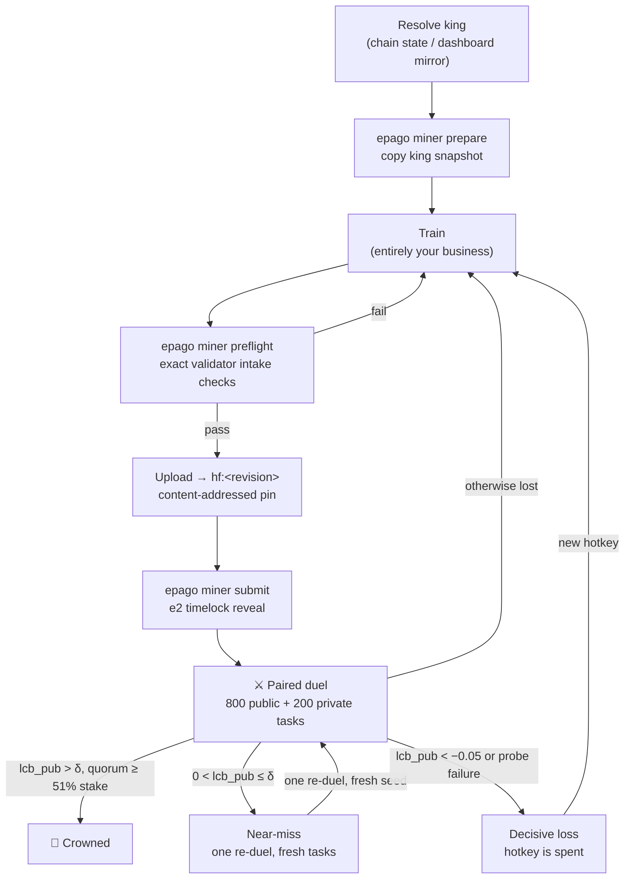

# ⚒ Model mining

*Train a better checkpoint than the reigning king, prove it in a paired duel, and wear the crown — and its emissions — until someone does the same to you.*

Model miners train challengers to the reigning king checkpoint and submit them for
paired duels. How you train is entirely your business — data, recipe, and compute are
unconstrained. What you submit is tightly constrained: same architecture as the king,
weights only, content-addressed, and it must beat the king by a statistically
significant margin on tasks neither of you has seen.

**What you are improving.** The crown is the world's frontier open deep-research model,
and it is small on purpose. The generation is seeded from **Tongyi-DeepResearch-30B-A3B**,
Alibaba's open (Apache-2.0) deep-research model — a 30.5B mixture-of-experts with **~3.3B
active parameters per token**, which is why a single consumer GPU is enough to fine-tune
and duel it. `EPAGO-DR-30B` is Epago's name for the competition lineage that starts from
that base, not a model of Epago's own — every crown since genesis has had to out-duel it. Deep research is a procedure rather than a knowledge store — the facts are
in the corpus, not the weights — so what you are actually training is a *procedure*:
decompose, search, open sources, read, cross-check, attribute. The pinned corpus spans
all of scientific literature — 50,420 papers across ~135 fields in the four OpenAlex domains
(life, physical, health, social) — so the procedure has to hold on a materials-science
or economics abstract as readily as on a clinical one; the same skill is what later
generations will pay for in law, patents, and regulatory filings, so procedure gains
travel and corpus memorization does not.

**Where the headroom is.** The base model's published benchmark results are strong (§7
of the [whitepaper](WHITEPAPER.md)), but on Epago's own deliberately harder exam it
measures **33.9%** full-tooling accuracy against a 56.1% perfect-retrieval ceiling, and loses
most of its remaining points to research episodes abandoned at the turn, clock, or context
budget rather than to wrong answers. Episode completion is therefore the cheapest
available win and the first thing worth attacking: a checkpoint that reliably finishes
its elimination search — well-formed native `<tool_call>` turns, no runaway thinking
loops, an answer before the budget closes — converts existing capability
into scored answers before any capability gain is needed.

Read the [mechanism spec](DESIGN.md) once; every number below comes from it, and the
code is the final authority.

## Lifecycle



| # | Step | What happens |
|---|---|---|
| 1 | **Resolve the king** | Read the current king (repo + digest) from chain state; at genesis it is `chain.seed_repo` at `seed.seed_digest`. Your submission must be trained against, and will duel, exactly this snapshot. |
| 2 | **Prepare** | `epago miner prepare <out_dir>` materializes the king locally and copies it into your challenger folder. Confirm your target repo name matches the intake rules (below) *before* you train, not after. |
| 3 | **Train** | However you like. Keep the architecture identical: every config-lock key must match the king byte-for-byte. |
| 4 | **Preflight** | `epago miner preflight <challenger_dir> <king_dir> --repo <repo> --hotkey <ss58>` runs the exact checks a validator runs at intake — repo pattern, hotkey prefix, file hygiene, config lock, size cap, exact-copy check — with the same machine-readable failure codes. A submission that fails preflight will fail intake; there is no validator-side leniency. |
| 5 | **Upload** | Push the folder to your repo. The upload returns a revision hash; your model reference is `hf:<revision>` — an immutable, content-addressed pin. Editing the repo afterwards changes nothing: only the pinned revision is evaluated. |
| 6 | **Reveal** | `epago miner submit --repo <repo> --digest <digest> --king-digest <king_digest>` commits the payload `e2\|<king_digest>\|<your_repo>\|<your_digest>` through the timelock commit-reveal extrinsic. Your hotkey is not in the payload — the chain records who signed, and that is your authorship. It auto-reveals 5 blocks later, chain-stamped with its reveal block. Only your latest reveal counts; revealing again supersedes the previous one. |
| 7 | **Wait for a round** | Submissions queue. Every ~2 days the round authority opens a competition; your challenge enters the first round whose trigger lands *after* your reveal. |
| 8 | **Duel** | The whole field answers one exam against the king; each validator runs intake, probes, then the paired duel (800 public + 200 private tasks). The provisional winner is re-dueled once on a fresh exam and must clear the floor **twice** before its ACCEPT is committed (an unconfirmed win settles as a near-miss — the re-duel right stays intact). Each validator commits an `ev3` verdict per entrant; only the confirmed best entrant gets an ACCEPT. |
| 9 | **Coronation** | When ACCEPT verdicts cover ≥ 51% of active-evaluator stake, you are crowned at the crossing block. Emissions start flowing to your hotkey per the reign schedule, with a coronation bonus proportional to your measured improvement. |

Track your submission with `epago miner status <hotkey> --state <path-or-url>`
against any validator's published dashboard state. `epago miner submit --dry-run`
prints the `e2` payload without touching any chain.

## Intake rules

Your submission is rejected before any GPU time if it violates any of these:

| Check | Rule |
|---|---|
| **Repo name** | Matches `^[^/]+/EPAGO-DR-30B-.+$` **and** contains the first 8 characters of your hotkey (case-insensitive). Example: hotkey `5FHneW46...` → `myorg/EPAGO-DR-30B-5fhnew46-run7`. |
| **Fresh parent** | The `king_digest` in your reveal must be the reigning king. If the king changes between your training run and your reveal, you are dropped as `stale_parent` — re-verify before revealing. |
| **Config lock** | `config.json` matches the king on all locked keys (architecture, sizes, heads, rope settings, embedding tying, context length — full list in the spec). `auto_map` is forbidden. |
| **Safetensors only** | No `.py` files anywhere in the repo; no `.bin`/`.pt`/`.pkl`/`.ckpt` weights; only `.safetensors`, `.json`, `.txt`, `.model`, `.jinja` files; canonical `model.safetensors` or sharded index layout. |
| **Size cap** | Total safetensors bytes at most 1.05× the king's. |
| **Not a copy** | Per-shard equality with the king is rejected, and a digest already revealed by another hotkey belongs to that hotkey. Weights that have **ever dueled** are terminal under every digest: re-uploading or re-sharding them mints a new digest but hits the persistent weight-fingerprint registry (`duplicate_weights`) and cools your hotkey down. |
| **Probes** | Your model must produce well-formed episodes on at least 55% of 20 trivial format tasks (native tool-calling: JSON `<tool_call>` turns, a final `<answer>`), and pass weight-norm sanity ratios. The bar sits below the base model's own measured compliance — the gate rejects checkpoints that cannot operate the harness at all, not imperfect ones. |

## ⚔ The math you must beat

Your duel is scored on paired per-task differences `d_i = your_i − king_i`. On the
public half (800 tasks), a one-sided 99.9% bootstrap lower confidence bound on the
mean difference (`lcb_pub`) must exceed the adaptive floor:

```
delta = max(0.05 × (1 − king_acc_ema),  1 × noise_floor)
```

and your private-half mean difference must be positive on every accepting
validator's private pool.

**What `noise_floor` actually is.** Not a formality. GPU inference is not
bit-reproducible — on the reference stack the *same* checkpoint re-scored on the *same*
400 tasks flips correctness on 84 of them (21%), on one card as much as on eight. The
floor a validator clamps on is the standard error of the paired score gap between two
king-vs-king sweeps, measured at **≈0.030 at n = 128**. That is the band your `lcb_pub`
has to clear before anyone can tell your model apart from a lucky rerun of the king.

**Worked example.** Suppose the king's accuracy EMA is 0.55 (the difficulty controller
aims for the 0.45–0.65 band) and the validator's calibrated floor is 0.030:

- headroom term: `0.05 × (1 − 0.55) = 0.0225`
- noise clamp: `DELTA_NOISE_MULTIPLIER × 0.030`
- with the shipped multiplier the noise clamp binds, so plan against `delta ≈ 0.03` or
  higher rather than against the headroom term. Check the live value on the dashboard
  (`delta_clamp`) instead of assuming a static fallback — it moves with the reigning
  king's hardware, and it moves the bar you have to clear.

Now suppose on the 800 public tasks you solve 30 tasks the king misses and the
king solves 6 you miss (164 ties): mean difference `μ̂ = 24/200 = 0.12`. The
bootstrap LCB at 99.9% lands (illustratively, via the normal approximation with
standard error ≈ 0.029) around `0.12 − 3.09 × 0.029 ≈ 0.03 > 0.0225` — accepted.
A thinner win of, say, +10 net tasks (`μ̂ = 0.05`) has an LCB below zero and loses.

The bar is deliberately high per duel: a coronation is a 99.9%-confidence event,
and the floor scales down automatically as the king gets harder to improve.

## Where your model lives

Two ways to submit. They differ in one thing only: **who can read your weights
before you win.**

### Private (recommended)

Upload into the validator's own store. Only you and the validator can read it,
so a checkpoint that loses is never handed to the rivals that beat it.

Requires an **Ed25519 hotkey**, because the validator encrypts your upload
credentials to it and ordinary sr25519 hotkeys have no encryption:

```bash
btcli wallet new-hotkey --wallet.name <wallet> --wallet.hotkey <hk> --key-type ed25519
```

Then, once your hotkey is registered on the subnet:

```bash
epago-miner auth   --mailbox <validator mailbox URL> --wallet-name <wallet> --wallet-hotkey <hk>
epago-miner upload --folder ./checkpoint
epago-miner submit --repo <printed repo> --digest <printed sha256:...> --king-digest <king>
```

`auth` reads a **public** file containing one envelope per miner and opens the
one addressed to you. Everyone can read that file; only your hotkey opens your
entry, and the payload is signed so you can tell a real credential from a
forgery pointing at someone else's bucket.

Your credentials are **write-only and scoped to your own prefix**. You cannot
read, list or overwrite anything — not even your own upload. That is
deliberate: a credential that cannot read cannot leak anything if it is stolen.
They expire after a few hours; re-run `auth` if an upload spans longer.

### Public

Push to a Hugging Face repo you own matching `^[^/]+/EPAGO-DR-30B-.+$` and
submit `hf:<revision>`. Validators fetch that exact revision with no token, so
a private repo cannot be evaluated, and later commits change nothing.

Simpler, no credentials, no key-type requirement — and **your weights are
visible to every competitor the moment you reveal.**

### What happens when you win

A crowned model is republished at `kings/<digest>/`, readable by anyone.

That is the deliberate trade: a challenger stays private so nobody can copy it,
and the king becomes public so the model actually collecting emissions can be
re-scored by anyone. If you lose and believe you were scored unfairly, publish
your own weights and let anyone check — the burden sits with the party making
the claim, which costs you nothing but the secrecy you were keeping anyway.

## One submission per hotkey

**A hotkey gets one submission, permanently.** Whatever happens to it — crowned,
near-miss, or beaten — that hotkey is spent. Another attempt means registering a
fresh hotkey and paying the registration burn.

Plan around it. There is no way to iterate cheaply against the live exam, and
that is deliberate: if attempts were free the cheapest strategy would be to
upload many mediocre checkpoints and let the duels find one that got lucky on
its holdout, and every one of those costs validators a full rollout sweep.
Pricing each attempt pushes the spend back into training, which is the only
thing that actually moves your score.

Three practical consequences:

- **Run `preflight` before every reveal.** It is free, it runs the same intake
  gates the validator runs, and a submission refused at intake does *not* spend
  your hotkey — only a submission that reaches the queue does.
- **Do not submit to probe the exam.** A losing submission tells you very little
  and costs a registration.
- **Do not split one improvement across several hotkeys.** The coronation bonus
  scales with measured improvement, so revealing a whole improvement at once
  pays more than dribbling it out, and each slice costs its own burn.

## Near-misses

Losing with `lcb_pub > 0` — you are probably better, just not provably by
`delta` — is a **near-miss**, and it is treated as an honest attempt:

- no failure memory, no penalty;
- **one immediate re-duel on a fresh seed.** That is the same submission being
  re-judged against new tasks, never a resample of the same exam, and it does
  not require a second hotkey.

A near-miss does not earn emission. The arena pays former kings, not
challengers — see the emissions section of the whitepaper.

## No bonds

Nothing is escrowed to submit. The registration burn behind each hotkey is the
whole anti-spam instrument, and it prices attempts directly rather than
throttling them after the fact.

Rotating to fresh hotkeys is exactly what a serious miner does between attempts,
and exactly what makes spamming expensive: every hotkey must win a competitive
UID and pay its own burn, so a flood of junk costs the flooder linearly while
honest submissions flow past unaffected.

## Why copying doesn't pay

A copy of the king — exact or perturbed — must beat the king by `delta` in a
paired duel on tasks chosen after your reveal. An exact copy is rejected at
intake by shard comparison, and the digest-ownership rule means you cannot claim
someone else's checkpoint by re-revealing it. A perturbed copy passes intake but
is, statistically, the king plus noise: its paired differences center at or below
zero, and it cannot clear a 99.9% lower confidence bound above `delta`. It also
costs a hotkey, since that hotkey is spent whatever the verdict. The mechanism
does not try to detect copies; it prices them at zero and charges for the
attempt. Two more rules close the residual luck: near-ties inside the
calibrated noise floor go to the **earlier reveal** (a perturbed copy of a pending
rival cannot out-place its source without out-scoring it beyond noise), and every
provisional winner must clear the floor **twice** — once in the round, once on a
fresh confirmation exam — before it is crowned, which squares the odds of any
lucky ticket.

## Why slicing doesn't pay

If you hold a large improvement, revealing it in small `+delta` slices to farm
successive coronations does not work economically. A self-dethrone — the same
hotkey re-crowning itself — inherits the previous reign clock, so slices from one
hotkey buy no fresh reign-decay resets. Slicing across *fresh* hotkeys would reset
the clock, but each fresh hotkey must win a competitive UID and pay its own
registration burn, so the resets are bought, not free. The coronation bonus is proportional to
`min(lcb/delta, 3.0)` and is paid per coronation over 24 hours, so one full-size
reveal earns at least as much bonus as the sum of the slices while risking duel
variance only once. Meanwhile each extra slice is another chance for a rival to
dethrone you between reveals. Revealing everything you have, as soon as you have
it, weakly dominates.
