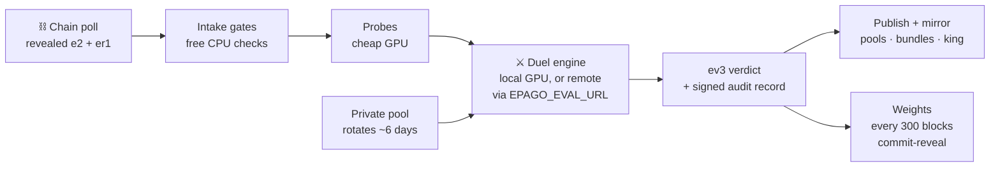

# 🛡 Validating on Epago

*Provision a CPU box and a GPU eval box, start the stack, keep it powered — the box does the rest.*

An Epago validator is a box, not a job. Task generation, duels, verdicts, audits,
publication, and weights are all autonomous. **There are no manual runbooks in this
repository because there are no manual operations.** If a document ever asks a
validator operator to make a judgment call, that is a mechanism bug; file it as one.

What the box decides is which checkpoint holds the crown for the world's frontier open
deep-research model, in whichever chain generation it is configured for — in the current
generation, all of scientific literature. Nothing below is field-specific: the corpus and
task release are the `chain.toml` the box loads.
And every duel the box runs emits verified `(task, answer, correct/incorrect)` records
over freshly published documents, which is why the audit trail and the rotated pools are
published in full rather than merely digested.

## Hardware

A validator is two roles, which can share one machine:

| Box | Runs |
|---|---|
| **CPU box** | Chain client, corpus, task pipeline, duel queue, audit log |
| **GPU eval box** | vLLM rollouts for duels, probes, and calibration |

Size the GPU box empirically rather than from a spec sheet:

```bash
python scripts/measure_determinism.py --model-dir <seed-model-dir>
```

It measures per-rollout wall clock and same-box noise on *your* hardware and projects
the cost of a full `N_PUB + N_PRIV × 2` duel. Three environment knobs trade throughput
against GPU memory:

| Knob | Effect |
|---|---|
| `EPAGO_ROLLOUT_CONCURRENCY` | Concurrent rollouts per duel, step-batched through the engine (default 32). Raise until the GPU saturates; lower when memory-constrained. |
| `EPAGO_EVAL_LOW_VRAM` | Keeps one engine resident at a time — roughly halves peak GPU memory at the cost of one model reload per duel. Single-GPU boxes only; a multi-GPU box has no reason to swap. |
| `EPAGO_VLLM_GPU_MEM_UTIL` | Explicit per-engine share of GPU memory (vLLM `gpu_memory_utilization`). |
| `EPAGO_EVAL_GPUS` | Which cards the evaluator may use (default: all visible). A count (`4`) or a list of logical indices into the visible set (`0,2,5`; `3,` for exactly one). |

### Using every card

A box with more than one GPU runs one **whole model replica per card** and shards the
task set across them. There is no tensor parallelism: splitting a model across cards
would change reduction order and therefore logits, and two validators with different
card counts would then return different verdicts. Every replica is the same engine a
single-GPU validator loads, in a process that can see exactly one GPU — a replica is
not "a model on card 5", it is a single-GPU validator's engine that happens to live on
card 5. The one-card path is completely unchanged; it never builds a pool at all.

Allocation is one rule: `replicas_per_sweep = max(1, n_gpus // n_pending_sweeps)`. A
sweep is one model answering the exam once, and a competition round with N entrants is
N+1 sweeps (the king answers once and is reused). So a lone duel on 8 cards puts 4
replicas on each side, while a round of 32 entrants runs 33 sweeps as a straight work
queue with every card busy. A card keeps its model until it is handed work for a
different one, so the king stays warm across duels rather than being reloaded each
time.

Expect sub-linear scaling. Measured on 8x RTX 5090 with a 17 GB 4-bit checkpoint,
128 tasks at concurrency 16 — a deliberately small job, which is the pessimistic case:

| replicas | wall | speedup | decode-only speedup |
|---|---|---|---|
| 1 | 568.9s | 1.00x | 1.00x |
| 2 | 422.9s | 1.35x | 1.40x |
| 4 | 274.1s | 2.08x | 2.33x |

Two things eat the difference, and both shrink as the job grows. Every configuration
pays the same ~50s model load, which is 19% of the four-replica wall here and about 1%
of a full-exam sweep. And a shard of 32 tasks against a concurrency of 16 spends much
of its life half-drained, where a shard of 250 does not. Size your expectations from
your own `--n`, not from this table.

Verify it on your own hardware before trusting it:

```bash
.venv-eval/bin/python scripts/gpu_equivalence.py \
    --model <king-dir> --corpus <corpus.db> --devices 0,1,2,3 \
    --replicas 1,2,4 --n 128 --baseline
```

It runs one model over one task set at each replica count and prints an agreement
table plus the speedup table. Read the `gap SE` column against the `r1-repeat` row.
That row is one replica compared against *itself* on a second run — this box's own
noise floor — and it is not zero: a quantized MoE checkpoint under vLLM does not
reproduce itself bit-for-bit even with `EPAGO_VLLM_DETERMINISTIC=1` and a batch of
one, because the fused MoE kernels reduce in a nondeterministic order. So the bar
is not "identical", which nothing can meet; the bar is that the sharded rows sit at
that floor. A sharded row clearly above it means this box's replicas are not
interchangeable, and it should run on one card until that is understood.

Four things to get right when you turn it on:

- **Unset `EPAGO_VLLM_GPU_MEM_UTIL` and `EPAGO_EVAL_LOW_VRAM`.** Both exist because two
  engines used to share one card. They no longer do — each replica has a card to
  itself — so a leftover memory cap just shrinks every replica's KV cache, and
  low-VRAM mode is ignored on the pooled path.
- **The rollout timeout is wall-clock.** An episode that runs past
  `EPAGO_ROLLOUT_TIMEOUT_S` scores wrong, so anything that changes per-episode speed
  can change a score at the margin. Replicas each decode at the same batch size a
  single-GPU sweep uses, but they do share the box's CPU and disk; if your box is
  CPU-starved, raise the timeout rather than accept timing-dependent verdicts.
- **The LLM judge gets its own card** when it is enabled and the box has three or
  more, because it must stay resident while replicas run. On a two-card box no card
  is reserved and the judge shares, exactly as it does today.
- **Loading is a small share of the work.** A full exam sweep spends tens of minutes
  decoding against roughly a minute loading (measured: ~49s to bring a 17 GB 4-bit
  checkpoint up on one card, ~4s of decode per task at concurrency 16), so a reload
  costs low single-digit percent. The pool still keeps a checkpoint resident until
  a device is needed for a different one, because there is no reason to pay even that
  — but do not expect affinity scheduling to be what makes a round fast. Replication
  is.

Public-half verdicts require the full duel — there is no GPU-less verdict path. A
validator that cannot run duels is a follower, not an evaluator, and earns accordingly.

## Install

```bash
git clone <repo-url> epago && cd epago
python3.12 -m venv .venv && source .venv/bin/activate
pip install -e ".[chain]"          # CPU box
pip install -e ".[chain,eval]"     # eval box (adds torch, vLLM, transformers)
```

Or use the compose skeleton in [`docker/`](../docker/docker-compose.yml), which runs
the validator service on the CPU side and reserves the GPU for the eval service.

## State directory and corpus

All mutable state lives under one directory (default `~/.epago/validator`, moved with
`--state-dir`); the model cache is separate (`--cache-dir`, default `~/.epago/models`):

| Path | Contents |
|---|---|

## What the box publishes, and where

Two stores, split by who writes them: **Hugging Face holds what miners submit
publicly; the object store (Cloudflare R2) holds everything the validator
produces, plus private miner uploads.**

Everything below is synced by `epago/publishing/publisher.py` under one
namespace per validator:

| path | contents | who can read |
|---|---|---|
| `submissions/<hotkey>/` | a miner's private checkpoint | that miner and this validator |
| `kings/<digest>/` | a crowned model | anyone |
| `mailbox/credentials.json` | one sealed envelope per miner | anyone can fetch; each opens one |
| `{validator}/publications/` | private task pools, published at rotation | anyone |
| `{validator}/audit/audit.jsonl` | the append-only duel record | anyone |
| `{validator}/audit/published/` | rendered tasks, rollout transcripts and sealed-pool round files, after the embargo | anyone |
| `{validator}/dashboard/` | `dashboard.json` and the static site | anyone |

Four properties worth knowing:

- **The embargo is enforced by path.** `audit/delayed/` is never uploaded. Only
  what `AuditLog.release_due` has moved into `audit/published/` ships, so a task
  set under its transparency delay cannot leak through a sync.
- **Objects are never deleted.** A retired pool or an old audit bundle stays
  where it is, because a verdict that referenced it must remain replayable.
  Retiring content means publishing a new revision that supersedes it.
- **Sync never raises.** Every failure is collected into a report, so one bad
  file or a network blip cannot stall the validator loop. Unchanged files are
  skipped via a local manifest, so a watch loop is cheap.
- **A crowned model is found by derivation, not by a pointer.** `kings/<digest>/`
  is computable from the digest alone, so any party constructs it without a
  manifest or a call to whoever published it. Content addressing does the rest:
  a fetch is only accepted once the bytes rehash to the committed digest.

## Running a sealed public pool

A release whose name begins with `POOL` serves the public half from a pre-minted
file instead of the generator (DESIGN §4.0.4). Mint a pool, audit it, then seal it:

```bash
python scripts/mint_intersections.py --out pools/pool1.jsonl --n 6000
python scripts/verify_pool.py --tasks pools/pool1.jsonl      # re-derives every claim
python scripts/seal_pool.py  --pool  pools/pool1.jsonl --n-pub-tasks 800
```

`seal_pool.py` writes the task-id manifest and prints the contract block to paste.
The contract pins two digests, and both must be set before the first round opens:

```toml
taskgen_release            = "POOL1"
public_pool_path           = "/srv/epago/pools/pool1.jsonl"
public_pool_digest         = "sha256:..."   # the pool file's exact bytes
public_pool_manifest_path  = "/srv/epago/pools/pool1-manifest.json"
public_pool_manifest_digest = "sha256:..."  # the manifest's canonical bytes
```

**Order matters, and getting it wrong cannot be undone.** Commit both digests
first, publish the manifest, and only then open a round. Publishing the pool file
itself, or opening a round before the digests are committed, hands miners an exam
they can train on — and no later correction removes what they have already seen.

The manifest holds task ids and nothing else, so it is safe to publish
immediately; it is what auditors verify rounds against while the pool is still in
service. The pool file stays sealed until it retires.

**Rounds are disjoint, so a pool is consumed.** Each round retires the
`N_PUB_TASKS` it asked. Size a pool for how long you want it to last:

| rounds served | tasks needed at `N_PUB_TASKS = 800` | at one round per 2 days |
|---|---|---|
| 4 | 3,200 | ~1 week |
| 8 | 6,400 | ~2 weeks |
| 15 | 12,000 | ~1 month |

When the unserved remainder falls below one exam the validator refuses the round
and records `taskgen_failed`; mint and commit a fresh pool before that happens.

Mint in tranches rather than all at once. The pinned corpus supports roughly
28,000 accepted tasks in total (DESIGN §4.0.4), and the corpus is being extended
with more papers over time, so a pool minted later draws on a larger supply than
one minted today. Minting a year of exams up front would spend that ceiling
before the corpus has grown into it.
Rotating is safe at any time — ids are content-addressed, so a task carried into a
new pool keeps the id it was published under and stays retired.

## Enabling private submission

Optional. With none of this set, the validator publishes no mailbox and miners
submit publicly through Hugging Face exactly as before.

```
EPAGO_S3_ENDPOINT          https://<account-id>.r2.cloudflarestorage.com
EPAGO_S3_BUCKET            your bucket
EPAGO_S3_ACCESS_KEY        the validator's own read/write credentials
EPAGO_S3_SECRET_KEY
EPAGO_R2_ACCOUNT_ID        Cloudflare account id
EPAGO_R2_PARENT_ACCESS_KEY a bucket-scoped R2 API token, created once
EPAGO_R2_PARENT_SECRET_KEY
```

The parent token is created once through the Cloudflare API and scoped to the
bucket. Per-miner credentials are then derived from it **locally**, by signing
a JWT that names one prefix, an expiry, and a write-only action list. No API
call per miner, so issuing credentials cannot fail between deciding to issue
and being able to.

Each credential can `PutObject` and complete a multipart upload, and nothing
else. No `GetObject`, no `ListObjectsV2`, not even inside the miner's own
prefix. A miner does not need to read back what it just wrote, and a credential
that cannot read cannot exfiltrate if it leaks.

The mailbox is republished every `EPAGO_MAILBOX_INTERVAL_BLOCKS` (default 600),
well inside the credential lifetime. Republishing too often would invalidate an
upload already in flight; too rarely would leave miners holding dead
credentials.


## Run

```bash
epago validator run --netuid <N> --corpus /data/corpus.db \
    --wallet-name my_cold --wallet-hotkey my_hot
```

All mechanism parameters come from `chain.toml` (environment overrides such as
`EPAGO_NETUID` exist for testnets). An optional `--ingest-dir` names a drop directory
for post-snapshot documents feeding the private task pool. The process refuses to
start if commit-reveal weights is not enabled on the netuid.

### CPU/GPU split (remote eval)

When the chain client and the GPU run on separate boxes, start the rollout server on
the GPU box and point the validator at it:

```bash
# GPU box:
epago eval serve --corpus /data/corpus.db --host 0.0.0.0 --port 8900

# CPU box:
export EPAGO_EVAL_URL=http://<gpu-box>:8900
export EPAGO_EVAL_TOKEN=<shared-secret>   # bearer token; the server rejects
                                          # requests without it
epago validator run ...
```

Leave `EPAGO_EVAL_URL` unset to run both on one machine. The docker compose skeleton
wires this split for you; for a full bring-up sequence on the test network (including
this split) see the mechanism spec, [DESIGN.md](DESIGN.md).

## Dataflow

One loop, no operator in it:



## What the box does autonomously

| Behavior | What happens |
|---|---|
| **Ingestion** | Builds and refreshes its own private task pool from post-cutoff ingestion and template synthesis, gating every task through the automated QA pipeline (corpus re-derivability, ambiguity check, source-mask verification, difficulty band). |
| **Rotation** | Rotates the private pool every ~6 days and publishes the outgoing pool in full — tasks, answers, evidence paths — making its own past private verdicts publicly replayable. Not optional; no off switch. |
| **Duels** | Watches the chain for revealed `e2` challenges and queues them. When the round authority publishes an `er1`, it runs intake gates and probes over the whole queued field, then duels every entrant against the king on one exam; commits an `ev3` verdict for every entrant in a round and appends the full audit record. |
| **Calibration** | Schedules king-vs-king calibration duels and recomputes the harness noise floor by the pinned formula; the adaptive `delta` clamp follows automatically. |
| **Audit publication** | Publishes `ea1` checkpoints every 100 audit records and releases full audit bundles after the publication delay; runs the external benchmark anchor on schedule and publishes the scores. |
| **King mirroring** | Keeps a local mirror of the current king snapshot so a deleted upstream repo can never orphan the crown. |
| **Weight setting** | Derives the king and arena weights as a pure function of chain state every 300 blocks and submits them via commit-reveal. There is no way to hand-set weights through Epago tooling. |

The loop stages every public artifact under the state directory; to mirror them to a
public dataset repo, run the publisher alongside it:

```bash
epago publish watch --state-dir ~/.epago/validator --repo-id <org>/<audit-repo>
```

### External benchmark anchor

The anchor is the eval-of-the-eval: internal king accuracy climbing while scores on an
external public benchmark stay flat means the task generator is being gamed. Enable it
by pointing the box at a benchmark file:

```bash
export EPAGO_ANCHOR_BENCHMARK=/path/to/benchmark.jsonl
export EPAGO_ANCHOR_MAX_TASKS=100   # optional per-run cap (default 100)
```

The file is JSONL, one `{"id"?, "question", "answer", "aliases"?}` object per line —
public deep-research benchmarks fit directly. **Benchmark files are user-provided; the
repo ships none** (licensing varies by benchmark), and every run records the file's
`sha256` digest so scores are only comparable when digests match.

Every `ANCHOR_INTERVAL_BLOCKS` (~7 days) the box runs the current king over the
benchmark through the same single rollout harness and judge cascade as duels
(closed-book when the corpus tools don't apply), and records the divergence between
internal EMA gain and anchor accuracy gain. Divergence above `ANCHOR_DIVERGENCE_ALERT`
raises a machine-readable alarm (`last_error.code == "anchor_divergence"`) — an alarm,
never a halt. Anchor results are strictly observational: they never affect verdicts,
weights, or coronation. Results land in `state.json` (`anchor_history`), publish into
the audit directory (`audit/published/…_anchor-<block>.json`), and render as the
`anchor` section of the dashboard export.

## Verifying your box agrees with the network

Determinism is the whole point — check it:

```bash
# Replay any published audit record (yours or anyone's) from public data,
# cross-checked against the on-chain ev3 verdict:
python scripts/replay_verdict.py <audit-record.json> --corpus /data/corpus.db \
    --verdict "<ev3-string>" --netuid <N>     # omit --netuid for offline replay

# Quick self-test that the eval stack runs end to end on this hardware:
python scripts/smoke_eval.py
```

`replay_verdict` runs on a CPU with no model and no GPU. It re-derives both seeds from
the reveal block hash, regenerates the public task set and checks its ids digest,
verifies the corpus and private-pool digests, recomputes the bootstrap LCB **from the
per-task difference vector recorded in the audit record**, recomputes the `audit16`
digest, verifies the validator's signature, and cross-checks the on-chain `ev3`
commitment. Every check PASSes, FAILs, or SKIPs — never silently passes. A FAIL means
either your inputs or the committed verdict is wrong, and the record says which pins
differ. Private halves of past epochs check the same way from the published pools
(`--private-pool`).

What `replay_verdict` does *not* do is re-run the models, and no tool can do that
exactly: the same checkpoint on the same tasks disagrees with itself on ~21% of them,
so a re-scored difference vector never reproduces a recorded one bit for bit. Checking
the scores is a separate, statistical step — re-score the regenerated task set and read
the paired gap against your own calibrated floor (`gap SE ≈0.030 at n = 128` on the
reference stack). A fabricated difference vector diverges far past that floor; a
fabrication small enough to hide inside it is too small to have moved the verdict.

So: your own verdicts should match other validators' **derivations** exactly — same
seeds, same task ids digest, same LCB from the same diffs. They will *not* match on the
raw per-task scores, and that is expected, not a defect. What would be a defect is a
public-half divergence that persists well beyond the floor your calibration duels
measure; that means a pin differs, not that the GPUs disagree.

## Observing the box

Every observation surface is read-only:

| Surface | Shows |
|---|---|
| `epago validator state` | Durable state summary: king, queue depth, clean duels, dethrones, pending mirror, last error |
| `epago validator sla` | Reveal-to-verdict latency report (p50/p95 in blocks) |
| `GET /health` on the eval server | Liveness of the rollout backend (stays open for load balancers) |
| `epago chain watch-reveals --netuid <N>` | Stream of `e2`/`er1`/`ev3`/`ep1`/`ek1` payloads landing on chain |
| `epago dashboard watch --state-dir ~/.epago/validator --out ./dashboard` | Human-readable static dashboard from the same state ([DASHBOARD.md](DASHBOARD.md)) |

The dashboard is one self-contained HTML file plus one JSON file — host it anywhere or
nowhere; anyone can regenerate it from your published artifacts and diff it against
what you serve.

These are for observation only. Nothing on the box takes commands at runtime; the only
inputs it honors are the chain and `chain.toml`.
