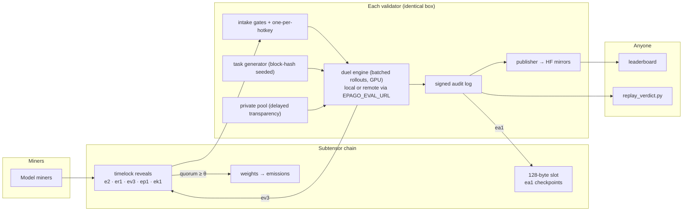

# Epago — the complete project handbook

*Everything about this subnet in one document: what it is, why every mechanism is
shaped the way it is, every component, every constant, and the exact state of the
build. If you read one document before working on this codebase, read this one.*

---

## 1. What Epago is

Epago is a Bittensor subnet that produces one artifact: the **world's frontier open
deep-research model** — small enough to run and fine-tune on modest hardware, provably
better every round. **Across all of scientific literature.**

The premise is that **deep research is a procedure, not a knowledge store**. The facts
live in the documents being read, not in the weights; what decides quality is
decomposing the question, searching, opening sources, reading, cross-checking
conflicting studies, and attributing each claim. Procedures distill into small models —
memorized world-knowledge does not — and in grounded research the recall a large
parameter count buys is supplied by the corpus instead. That is why "small beats big"
holds *here*, and why the claim stays narrow: superiority **at deep research, per unit
of compute**, never general intelligence.

The current chain generation is `EPAGO-DR-30B`, built on Alibaba's Tongyi-DeepResearch-30B-A3B —
**30.5B total parameters, ~3.3B active per token** (an MoE; not a dense 3B model). Its
authors' published results put it ahead of OpenAI o3 and DeepSeek-V3.1 (671B) on 5 of 7
agentic deep-research benchmarks — HLE 32.9 (24.9 / 29.8), FRAMES 90.6 (84.0 / 83.7),
xbench-DeepSearch 75.0 (67.0 / 71.0), WebWalkerQA 72.2, GAIA 70.9, BrowseComp-ZH 46.7 —
while **o3 leads BrowseComp, 49.7 to 43.4**. Those are the *base model's* numbers: the
floor this subnet starts from, not a result any Epago checkpoint has earned until a
coronation occurs.

On Epago's own deliberately harder exam the same model measures **33.9%** full-tooling
duel accuracy, against a 56.1% ceiling with perfect retrieval handed to it and a 17.3%
closed-book guessing floor. The numbers stay published, not buried: the 34-to-56 gap is
the retrieval skill the exam prices, and per-episode telemetry shows most lost points
die in research episodes abandoned at the turn, clock, or context budget — episode
completion is the first obvious target for any challenger.

Because the open frontier is small but **static** — a lab ships a checkpoint and moves
on, with nothing proving the next version is better rather than benchmark-tuned — the
model here is not trained by a team either. It improves through **adversarial checkpoint
competition**: anyone fine-tunes the reigning champion (*the king*), submits a
challenger, and independent validators run statistical **duels** between challenger
and king on freshly generated research tasks. A challenger that provably improves on
the king — at 99.9% confidence, across a stake-weighted quorum of validators — takes
the crown and its emission stream until someone dethrones it in turn.

The scope is **all of scientific literature**: the pinned duel corpus is 50,420 papers
balanced across the four OpenAlex domains (Life 1,450 · Physical 1,449 · Health 1,449 ·
Social 1,444), and the `SCI4` task release reads it through a field-neutral finding
vocabulary. The engine applies wherever claims trace to sources and answers are
mechanically checkable — a fabricated number is an integrity failure in every field and
a patient-safety event in some, and many of the buyers who need this most are regulated
parties who cannot send documents to a hosted API at all. §1.2 sets out what the engine
does after that.

### 1.1 The hard requirements the design answers to

Every design decision below traces to one of these owner requirements:

| # | Requirement |
|---|---|
| R1 | **Fully decentralized** — no owner API, no privileged operator, no trusted evaluator |
| R2 | **Fully automated** — zero human-intervention paths; no "notify the operator" anywhere |
| R3 | **48-hour evaluation SLA** per submission |
| R4 | **Spam-proof** — junk submissions must be strictly negative-expected-value |
| R5 | **Deterministic scoring** — verdicts must never be coin flips |
| R6 | **Benchmark correctness** — the eval itself must be verifiably right |
| R7 | **Overfitting structurally impossible**; high task variety |
| R8 | **Genuine improvement must be the only winning strategy** (no copy/hoard/slice meta) |
| R9 | Mechanisms that are **novel on the network** |

### 1.2 What scales, and what stays fixed

The mechanism in §2 is the fixed part. Everything a corpus needs is a chain contract,
so growth happens along four axes without touching the protocol:

| Axis | Today | Where it goes | What changes |
|---|---|---|---|
| **Corpora** | All of scientific literature — the four OpenAlex domains (life, physical, health, social) in one 50,420-paper snapshot | Law (case law, contracts) → patents → regulatory filings. Generations run in parallel, each with its own king. | A new `chains/*.toml`: corpus pins, task templates, arch lock keys. **Configuration, not code.** |
| **Tasks** | Constrained retrieval, comparison, computed evidence (`SCI4`) | Screening → cross-study synthesis → risk-of-bias appraisal → drafted review sections | A new task release in `epago/taskgen/`, graded by the same programmatic-first cascade |
| **Modality** | Text | Tables and figures, where most quantitative results actually live and every current model is weak | Task templates + corpus ingestion; the harness and duel math are unchanged |
| **Corpus reach** | Pinned snapshot (required for deterministic scoring) | Live retrieval (e.g. OpenAlex, Crossref) → the customer's own private document store | The `Search`/`Browse` tool backend in `epago/environment/`. The learned behavior is **retriever-agnostic** — swapping the backend is plumbing, not retraining |

Extraction is rung one because it is the rung that grades without a human in the loop,
which is what makes a trustless competition possible at all. The pinned corpus is a
*scoring* requirement, not a deployment limit: the exam must run against a byte-identical
world so independent validators pose the *identical exam* — same corpus bytes, same
BM25 rankings, same generated tasks, same answer keys. Their verdicts then agree
statistically rather than bitwise, because the model inference between the exam and the
score is not reproducible on any GPU stack we can buy (§5, §6). The exam is the part
that has to be identical; the mechanism is built to absorb a noisy scorer. The behavior
that exam selects for carries over to any retriever.

**The verified-reward-data flywheel.** Duels emit a first-class second output, not a
byproduct: every duel produces verified `(task, answer, correct/incorrect)` records over
documents published after the models were trained. That is **verified reward data** —
the scarcest input in AI post-training — and it cannot be scraped, because it does not
exist anywhere else. It already lives in the artifacts §2.11 and §2.3 require: the
signed audit records and the private pools published in full at rotation. Fresh
documents → generated tasks → duels → verified reward data → better models → a more
valuable crown → more miners → more duels.

---

## 2. Design rationale — why each mechanism is shaped this way

This section records the *why*. Each subsection names the failure mode the mechanism
exists to prevent. The failure modes are real: they are the documented history of
on-chain model competitions in general, and the mechanism is built so they cannot
recur here.

### 2.1 Why king-of-the-hill paired duels (and not a rating ladder)

The product is **one best model**, so the right primitive is a head-to-head test on a
single scalar: does the challenger beat the incumbent on the same questions? Paired
evaluation (both models answer the *identical* task set; only the per-task difference
`d_i = c_i − k_i` is scored) cancels task difficulty out of the statistic — a hard
exam and an easy exam yield the same unbiased estimate of the *difference* between
models. Rating systems, panels, and multi-metric scores were considered and rejected:
they add rank-noise across task sets, invite metric gaming, and answer a question
("how good is everyone?") the subnet does not need answered. One number decides.

### 2.2 Why tasks are generated *after* the submission commits

**Failure mode prevented: training on the test set.** Public eval sets are always
eventually memorized. Epago's duel tasks are derived deterministically from the
**block hash at the reveal** of the submission — entropy that does not exist until
after the challenger's weights are immutably committed via timelock commit-reveal.
Nobody, including the submitter, can know the questions in advance, because the
selection seed (`blake2b(block_hash ‖ hotkey ‖ label)` → PCG64) does not exist until
the weights are frozen.

How a third party then re-derives that exam depends on the release. A template
release regenerates it outright from the seed and the pinned corpus. A sealed-pool
release — whose questions a language model worded, and so cannot be a pure function
of a seed — is instead checked against artifacts committed before the round: the
pool's task-id manifest, from which the selection is redrawn exactly, and the round's
questions, published in full afterwards. Both routes make a verdict checkable by
anyone; the second needs those files fetched rather than recomputed.

### 2.3 Why every validator holds a private task pool — and why pools publish later

**Failure mode prevented: overfitting the generator.** Deterministic public tasks
alone have a weakness: a miner could overfit the *generator's distribution* (its
templates and its corpus) rather than getting genuinely better. So every duel has a
second half drawn from that validator's **private pool** — tasks minted from the
validator's own local sampling (and optional post-snapshot document ingestion) that
no miner has ever seen. Acceptance requires the private half's mean difference to be
positive on each accepting validator. Overfitting the network now requires
simultaneously overfitting every validator's independent secret pool.

Private evaluation usually costs auditability — "trust my secret test set" is exactly
the trust the subnet refuses to require. The resolution is **delayed transparency**:
each pool's digest is committed on-chain with every verdict that used it, and the
pool is **published in full when it rotates** (~6 days). Every private verdict
becomes retroactively checkable: the pool's digest, the tasks it contained, and the
arithmetic the validator ran on the scores it reported are all cryptographically
pinned, and a validator that reported a private half it could not have drawn from
the committed pool is caught by anyone, permanently. Checking the *scores* is the
statistical half of that audit — a re-scoring lands within the measured harness floor
(§5), so systematic fabrication stands out and a couple of flipped tasks does not,
which is also a couple of tasks short of moving a verdict. Secrecy while it matters,
accountability forever after. (R1 + R7 simultaneously — this pairing is one of the
subnet's novel mechanisms.)

### 2.4 Why coronation is a stake quorum, not a single evaluator's verdict

**Failure mode prevented: the trusted-operator hole.** A single eval server — however
well audited — is an owner-shaped hole in a "decentralized" system: one entity
controls verdicts, and its private holdout is a single unauditable secret. In Epago,
every validator runs the identical open-source box and publishes its own signed
verdict on-chain; a challenger is crowned at the first block where **accepting
verdicts cover ≥ θ (51%) of active-evaluator stake**. Coronation is a pure function
of public chain state — every observer derives the same king at the same block with
no coordination channel. No validator can crown or block alone; a dissenting
validator follows the quorum mechanically (weight-setting must converge) but its
dissent stays on the record and becomes checkable when its pool publishes.

A deliberate consequence: **weight-copying by validators becomes harmless to
correctness.** The weight vector is deterministic from chain state, so a lazy
validator that copies it changes nothing; and it cannot *fabricate* verdicts
profitably because verdicts are chain-stamped (no backdating), signed, and
retroactively replayable — exactly in the sense §2.11 makes precise: the derivation
replays exactly, the scores replay within the measured floor.

### 2.5 Why the statistical bar is a bootstrap LCB over an adaptive floor

**Failure modes prevented: lucky coronations and unwinnable late-game.**
- The acceptance statistic is a one-sided 99.9% **bootstrap lower confidence bound**
  (B = 10,000 resamples) on the mean paired difference — a false coronation requires
  a 1-in-1000 statistical fluke *per validator*, compounded across the quorum.
- The floor is **adaptive**: `δ = 0.05 × (1 − king_acc_ema)`. A constant floor is
  wrong at both ends — trivially easy against a weak early king, unwinnable against a
  strong late king. Scaling to remaining headroom keeps the *relative* bar constant
  across the king's whole life. The floor cannot be manipulated downward by miners:
  it moves only when the king's measured accuracy moves, and lowering that requires
  losing duels, which costs the crown.
- The floor is **clamped at or above the measured harness noise floor**
  (`DELTA_NOISE_MULTIPLIER × noise_floor`, from automated king-vs-king calibration
  duels). The floor is not a rounding error: re-scoring the *same checkpoint* on the
  *same* 400 tasks flipped correctness on **84 of them (21%)**, and the paired
  score-gap standard error — the unit `noise_floor` is actually in — measured
  **≈0.030 at n = 128**. Any verdict inside that band would be a coin flip. The clamp
  is what makes near-threshold verdicts statistically meaningful by construction (R5),
  and it is the reason the mechanism never needed inference to be deterministic.

### 2.6 Why emissions are "winner takes *most*" within a bounded band

**Failure mode prevented: hoarding and salami-slicing.** Pure winner-takes-all
provably drives rational miners to hoard improvements and everyone else to leave.
Epago's schedule keeps the arena alive:

- **King 90% falling to 85%** over ~3 days, then flat (share bleeds toward the arena as a
  reign ages undefended — an unchallengeable king still leaks incentive to
  challengers) and a **coronation bonus** proportional to the measured improvement
  (`min(lcb/δ, 3)` over ~24h — revealing a big improvement at once pays more than
  dribbling it out).
- **Self-dethrone inherits the reign clock**: crowning yourself *from the same
  hotkey* with a sliced +δ improvement does not reset decay, so slicing buys nothing;
  slicing across freshly registered hotkeys is deterred by the per-hotkey
  registration burn instead (R8).
- **Arena 10% rising to 15%**: the **three most recent former kings**, in equal
  shares. Being dethroned costs the crown, not everything — a displaced champion
  keeps earning for three more reigns before aging off. That is what makes losing
  the throne survivable and attacking it rational, and it is why one coronation
  does not end a miner's participation. Near-misses are not paid; what they earn
  is one re-duel on a fresh exam. Before the first coronation the roster is empty
  and its budget burns, so nothing is paid until something has been crowned. The
  arena receives exactly what the king does not take, so the two shares are the
  entire budget and always sum to 1.

### 2.5b Why competitions are rounds, and who opens them

The subnet evaluates in **rounds**: submissions queue continuously, and every
~2 days a round is opened — by an on-chain `er1` from a named authority, or by
the owner's local API trigger, whichever the contract configures. The
whole queued field then answers **one exam** against the king, and the best
entrant is crowned.

Two things follow from batching, and one from the trigger.

**Batching removes exam luck from the comparison between rivals.** Under a
per-submission exam two challengers of equal skill could be separated purely by
which questions each happened to draw; here the only thing that differs between
them is their own output. It is also what makes a large field affordable: the
king answers once and its results are reused, so N entrants cost N+1 sweeps
rather than 2N.

**Freshness is unchanged**, because it rests on ordering rather than on
per-submission entropy. The trigger is published after every entrant's weights
are already committed, and its block hash — which nobody, including the
authority, can choose — mints the exam. A reveal landing at or after the
trigger has already seen that hash, so it waits for the next round.

**The trigger is a privileged, owner-held key, and that is a real cost.** It
reverses R1 and R2. Whoever holds it can stop the subnet improving by declining
to open a round; there is no fallback that opens one without them. Validators
enforce what they can — only the configured authority is honoured, round
numbers must strictly increase, and starts must be at least
`ROUND_MIN_INTERVAL_BLOCKS` apart so rounds cannot be run back to back — but
the authority still chooses *when* inside the allowed window, which is enough
to wait for a favoured miner's submission to land. That residual trust is not
mechanically removable while the trigger exists.

### 2.7 Why copying is priced at zero instead of detected

**Failure mode prevented: copy-detection arms races.** Hash checks and recency
penalties are empirically insufficient against near-copies (a trivially perturbed
checkpoint evades any file-level fingerprint). Epago does not try to *detect*
near-copies at all: a copy of the king — exact or perturbed — is statistically the
king plus noise, and cannot beat the king by δ in a paired duel at 99.9% confidence.
The mechanism makes copying *worthless* rather than *detectable*. Exact content is
still rejected cheaply: shard equality against the king at intake, and a persistent
**weight-fingerprint registry** that makes weights terminal under every digest once
they have dueled — re-uploading or re-sharding known content mints a new digest but
not a new attempt, and cools the hotkey down. **Digest ownership belongs to the
first on-chain reveal** — you cannot claim someone else's checkpoint by re-revealing
it, and the timelock prevents mempool sniping. No spoofable registry timestamps are
consulted anywhere. Two rules close what luck is left: near-ties inside the
calibrated noise floor go to the earlier reveal, so perturbing a pending rival's
checkpoint cannot out-place the rival; and a provisional winner must clear the floor
twice — round plus fresh confirmation exam — before an ACCEPT is committed, which
squares the false-crown tail per attempt.

### 2.7b Why a challenger is private and a king is public

**Failure mode prevented: copying a rival's work.** If every submission were
public the moment it was revealed, the cheapest strategy would be to wait for
someone else's improvement, copy it, and resubmit. Copying the *king* is
already priced at zero — a copy cannot beat its own parent by δ — but copying a
**pending challenger** was not covered by that argument at all.

So a challenger uploads into `submissions/<its own hotkey>/`, and the
credential the validator seals to that hotkey is write-only and confined to
that prefix: it cannot read or list anything, including its own upload. Nothing
a miner holds can reach another's checkpoint. Revealing someone else's upload
as your own fails the prefix check at intake, which the digest could not catch
— a digest is computable by anyone who can read the bytes.

**Winning reverses it.** A crowned model is republished at `kings/<digest>/`,
readable by anyone, because the model actually collecting emissions has to be
re-scorable by anyone. That is the whole trade: privacy while it costs a miner
something, transparency once it earns.

A losing miner who believes it was scored unfairly can publish its own weights
and let anyone re-score against the audit record. The burden sits with the
party making the claim, and costs them only the secrecy they were choosing to
keep.

Public submission through a Hugging Face repository remains supported and needs
no credentials. It differs in one respect: everyone can read the weights
immediately.

### 2.8 Why one submission per hotkey, instead of bonds

**Failure mode prevented: spam — without custodial risk.** An economic bond
(stake-to-submit) requires either trusted custody or protocol-level slashing,
neither of which exists here without reintroducing an operator.

Instead a hotkey gets **one submission, permanently**. It is spent the moment
that submission reaches the duel queue, whatever the verdict turns out to be,
and another attempt means registering a fresh hotkey and paying its
registration burn.

This prices attempts in TAO rather than in time. The earlier design used an
escalating cooldown ladder — 24 hours, doubling on repeat, capped at six days,
scaled up under congestion — but time is a weak currency against a spammer
holding many hotkeys, who simply runs them in parallel. It also left a band
unpriced: a rule that fired only below `lcb = −0.05` charged nothing for the
whole `−0.05..0` range, which is exactly where a noise-perturbed copy of the
king lands. Those cost nothing to make, no gate flags them, and roughly half
draw a positive LCB by luck. Charging a registration burn per attempt is what
turns a per-duel significance bar into a bounded rate per miner.

A submission refused *before* the queue — malformed payload, unregistered
hotkey, bad repo name — does not spend the hotkey. Burning a registration over
a formatting typo would punish honest error rather than gaming. A near-miss
keeps its one re-duel on a fresh exam, since that is the same submission being
re-judged rather than a second one.

Identity is the hotkey: the registered neuron on the metagraph. Sybils multiply
cost rather than throughput, because every fresh hotkey must win a competitive
UID and pay for itself. Spam is negative-EV; a single honest attempt costs one
registration (R4).

### 2.9 Why the exam stays unpredictable without a second miner class

**Failure mode prevented: a predictable exam.** Any purely algorithmic task
generator is eventually characterizable, and a characterizable exam is gameable.
Epago answers this with freshness and secrecy rather than with paid
question-writers: the public half is minted from block-hash entropy that does not
exist until after the challenger's weights are committed, the private half comes
from each validator's own secret pool, and the pool is continuously refreshed from
a dated public document feed that postdates model cutoffs. An earlier design added
a paid task-mining track for the same purpose; it was removed because the same
property is already carried by those three mechanisms, and a second miner class
with its own emission share, QA pipeline, and collusion surface bought no
additional guarantee (R7, R9).

### 2.10 Why the chain carries fingerprints, never bodies

The Bittensor subtensor chain is used for exactly three things it is uniquely good
at: **unforgeable ordering** (who revealed a digest first), **unforgeable timing** (a
validator cannot backdate a verdict), and **binding tiny commitments to huge
off-chain objects**. Everything large — model checkpoints (GBs), the corpus (GBs),
audit logs, published pools — lives off-chain (Hugging Face + validator mirrors),
pinned by content hashes on-chain. Two chain facilities are used, matched to their
real constraints:

- the **timelock-reveal channel** (multi-entry per hotkey, chain-stamped blocks
  *and* chain-stamped signer) carries everything that must accumulate or be
  trustlessly ordered: `e2` challenges, `er1` round starts, `ev3` verdicts,
  `ep1` pool digests, `ek1` king pointers. Because the
  chain stamps the signer, no payload carries its own claim of authorship;
- the **plaintext commitment slot** (ONE string per hotkey, 128-byte hard cap,
  newest-write-wins) carries only the compact `ea1` audit checkpoint.

This split is load-bearing: verdicts in the overwriting slot would erase each other
and break quorum. (Discovered against the real SDK; the wire formats live in
`epago/core/reveal.py`.)

### 2.11 Why everything is replayable

**Failure mode prevented: "trust me" dashboards.** Every duel writes a signed audit
record binding all inputs: the reveal block hash, seeds, task-set digests, per-task
difference vector, private-pool digest and epoch, thresholds, harness digest.
`scripts/replay_verdict.py` re-derives, from chain data + the pinned corpus and with
no GPU and no model, every quantity the validator committed to: the corpus digest,
both seeds from the reveal block hash, the public task set and its ids digest, the
bootstrap LCB **from the recorded per-task difference vector**, the `audit16` digest,
the validator's sr25519 signature, the private-pool digest, and the on-chain `ev3`
cross-check. Every one of those is exact arithmetic and either matches or does not.
Private halves join that set when pools publish.

What replay does **not** do is re-run the models. Nobody can: the same checkpoint on
the same tasks disagrees with itself on ~21% of them (§5), so a re-scored difference
vector never lands on the recorded one and a bitwise comparison would be meaningless.
Replay therefore verifies that the recorded scores were turned into the published
verdict honestly — arithmetic, seeds, digests, signature, chain commitment — and an
independent re-scoring checks the scores themselves *statistically*, against the
measured floor. Wholesale fabrication of a difference vector diverges far past that
floor and is caught; a handful of flipped entries hides inside it, and also cannot
move a verdict that cleared δ with margin. That boundary is deliberate, not conceded:
the protocol was designed around a scorer that is known to be noisy. The leaderboard is a **pure file-to-file export** of these artifacts — anyone
can regenerate `dashboard.json` from a validator's published state and diff it
against what that validator serves. A dashboard that disagrees with the audit trail
is impossible by construction.

### 2.12 Why zero human operations

R2 is absolute: every "notify the operator" path in an earlier draft was closed by
construction. King repo deleted? Cannot orphan the subnet — every validator mirrors
the king's weights at coronation. Private pool curation? An autonomous
mint-QA-rotate-publish loop. Emission phase activation? A deterministic on-chain
condition (and on testnet, the phase-gate env zeros make emissions mainnet-equivalent
from block one). Constants that need tuning? Computed from rolling calibration by
pinned formulas. Queue overload? The circuit breaker prices intake in time
automatically. A validator is a box you power, not a job you do.

### 2.13 Why the anchor exists

**Failure mode prevented: silent benchmark drift.** If the internal task distribution
degrades (or is gamed), internal accuracy could inflate while real capability
stagnates. On a fixed schedule the validator runs the king against a user-supplied
external public benchmark file and records the divergence between internal EMA gain
and external gain into state, audit, and the dashboard — with a machine-readable
alarm above a threshold. Strictly observational: it can never affect verdicts or
emissions (R6).

---

## 3. System architecture



### 3.1 Component map (every module, what it is, why it exists)

| Path | What | Why it exists |
|---|---|---|
| `chain.toml` | The chain-generation contract: pins for corpus/model/judge, quorum + emission parameters | Single source of truth; one generation = one domain, and swapping or adding one is a config change, never a rewrite |
| `epago/config.py` | Typed loader for `chain.toml` with `EPAGO_*` env overrides | One parse point; validates share sums and θ bounds at load |
| `epago/constants.py` | Every mechanism constant, env-overridable | Testnets tune via env, mainnet runs defaults; nothing hand-edited at runtime |
| `epago/core/types.py` | Shared value types (`ModelRef`, `Task`, `DuelSpec`, `DuelOutcome`, `Verdict`, `AuditRecord`, …) | The interface contract every subsystem codes against; imports nothing heavy |
| `chains/` | One TOML per chain generation — i.e. per corpus + task release; `EPAGO-DR-30B.toml` pins the Tongyi-DeepResearch-30B-A3B base (MoE lock keys, immutable revision, SCI4 release) over the all-science corpus. Select with `EPAGO_CHAIN_TOML`. | A new base model or a new corpus is a new contract, never edits to a pinned one — changing a live generation's lock keys would silently re-judge every validator's holdouts |
| `scripts/fetch_papers.py` | Webis-SR4ALL-26 reviews -> OpenAlex abstracts -> `papers.jsonl` + `reviews.jsonl` (screening labels), with an on-disk cache so a pinned corpus is reproducible | Feeds `build_corpus.py`; a review's reference list is a curated, topically coherent collection with a known answer set |
| `scripts/rotate_holdout.py` | One full holdout rotation: harvest a fresh dated window -> publish it PRIVATE -> emit the new `[private_source]` pin as JSON -> optionally rewrite a contract's block (backup + old pin in a comment). `--dry-run` by default; the `auto-holdout` compose profile runs it weekly | Freshness is only a guarantee while the feed keeps moving, so rotation is a scheduled loop rather than a remembered command — and every failure mode (no token, throttled week, period already published, unreachable hub, public repo) is a refusal, never a half-publish |
| `scripts/harvest_holdout.py` | Multi-source harvest (OpenAlex, Crossref, Europe PMC, PubMed) over a recent window -> the sharded parquet the private holdout consumes, and the fetchers that built the pinned all-science corpus. `--domain` selects OpenAlex domains (default: all four; `1`=Life, `2`=Social, `3`=Physical, `4`=Health) and `--vocab {general,medical}` picks the mintability vocabulary | Scope is a flag, not a hardcode. Europe PMC and PubMed index biomedicine only, so they run biomedical themes only and are dropped from the plan when no biomedical domain is selected — a slice is never labelled broader than the index that produced it |
| `epago/core/reveal.py` | Wire formats `e2/er1/ev3/ep1/ek1/ea1`: build/parse with strict validation | On-chain grammar in one file; unknown versions drop with a warning, never crash |
| `epago/core/stats.py` | Seed derivation (blake2b-8), paired halves, bootstrap LCB, adaptive δ, noise floor | All duel math as pure functions — two machines, identical bits |
| `epago/core/quorum.py` | Coronation as a pure function of verdicts + stakes | Sorted-order stake summation and `(block, hotkey)` tie-breaks so every observer derives the identical crossing block — float-order divergence was a real bug class |
| `epago/core/emissions.py` | Weight vector: reign band, coronation bonus, former-king arena, phase gate | Economic policy as pure functions; every validator computes the same vector |
| `epago/chain/client.py` | `ChainClient` ABC + `BittensorChainClient` (SDK 10.x, verified) + `MockChainClient` | One adapter isolates the SDK; the mock mirrors both channels incl. reveal delay so tests exercise real timing |
| `epago/chain/doctor.py` + `cli.py` | `epago chain check [--probe-writes]` | First-contact preflight: verifies commit-reveal enabled, probes both channels end-to-end, measures actual reveal latency |
| `epago/model/store.py` | Content-addressed snapshot download/upload/verify, mirror fallbacks | TOCTOU-proof: only the pinned digest is ever evaluated |
| `epago/model/validation.py` | Config lock, file hygiene (safetensors-only, no code), size cap, exact-copy check | Architecture smuggling and disk exhaustion die at intake, zero GPU spent |
| `epago/environment/` | SQLite FTS5 corpus store, search/browse tool sessions, **source masking**, digest-verified sync, deterministic fixtures | The reproducible "world"; masking forces re-derivation instead of lookup |
| `epago/eval/harness.py` | THE single rollout loop (`Episode` state machine + batched driver); pinned system prompt; `harness_digest()` | Exactly one place the agent loop exists; the digest binds verdicts to the exact harness |
| `epago/eval/backend.py` | `ModelBackend` protocol; vLLM backend (greedy, pinned seed, `generate_many` batch API); scripted test backend | Batch step-feeding is what turns hours-long duels into tens of minutes |
| `epago/eval/duel.py` | Paired duel and the batch round runner (king swept once, every entrant on one exam), LCB, δ, outcome; low-VRAM mode | Low-VRAM releases the king engine between sweeps |
| `epago/eval/pool.py` + `worker.py` | Multi-GPU placement: one whole model replica per card in its own single-GPU process, sweeps sharded across replicas, model affinity and lazy eviction | Replication, never tensor parallelism — a split model would make verdicts depend on card count |
| `epago/eval/judge.py` | Programmatic-first cascade (exact → alias → numeric → optional pinned LLM judge), sanitizer, 67-payload adversarial CI suite | Imitable/gameable judges are a documented failure class; the LLM path is a guarded last resort |
| `epago/eval/probes.py` | Torch-free weight sanity (per-tensor/global norm ratios vs reparametrization tricks), format probe, degenerate probe | Minutes of cheap gating before hours of GPU |
| `epago/eval/server.py` + `remote.py` + `cli.py` | GPU eval server (`epago eval serve`, bearer auth, single-duel lock, SSE progress) + validator-side remote runner | The CPU-box/GPU-box split; the wire path is lossless — a remote duel returns a `DuelOutcome` bit-identical to the in-process one on the same inputs (scripted backend), so location changes nothing the protocol reads |
| `epago/eval/anchor.py` | External benchmark runner + divergence metric | The eval-of-the-eval (§2.13) |
| `epago/taskgen/` | Rule-based templates (`R1` → `SCI4`) with the field-neutral `FindingVocabulary` bound per release, seeded generator, **task QA pipeline** (derivability/ambiguity/masking/form), private pool lifecycle, ingestion, difficulty controller | Benchmark correctness is a pipeline, not a hope; dead templates retire automatically |
| `epago/validator/state.py` | Durable state: king, queue, spent hotkeys, arena, near-miss retry ledger, anchor history, SLA records; atomic writes | Crash-safe; the king is also re-derivable from chain, so state loss is recoverable |
| `epago/validator/intake.py` | The gate ladder + one-submission-per-hotkey + queue circuit breaker + near-miss retry consumption | R3/R4/R8 economics in one file |
| `epago/validator/audit.py` | Canonical unsigned digest (`audit16`), wallet signing, hash-chained log, `ea1` checkpoints, delayed publication | §2.11; signature never changes the digest the on-chain verdict commits to |
| `epago/validator/service.py` | The orchestration tick: scan → one duel end-to-end → verdict → quorum derivation → rotation/calibration/anchor → weights | Single-file readable core loop; every failure degrades machine-readably, never halts |
| `epago/validator/wiring.py` | `build_production_deps()` — the one place live subsystems meet (remote-eval switch, judge loading, managed pool, signer) | A seam mismatch is a wiring bug in exactly one file |
| `epago/publishing/` | HF dataset mirroring of publications/audit/dashboard, king snapshot republication, mirror resolution | Late-joining validators and external auditors need published state |
| `epago/dashboard/export.py` | Pure file→file export: state + audit → versioned `dashboard.json` | The leaderboard is an audit surface, not a website (§2.11) |
| `leaderboard/index.html` | Self-contained page (no external requests, dual theme, embedded logo) rendering `dashboard.json` or inline data | Anyone can host or regenerate it |
| `epago/cli.py` + `neurons/` | Unified `epago` CLI (validator/miner/chain/eval/publish/dashboard) + conventional entrypoints | One tool surface, heavy imports guarded per-command |
| `scripts/` | `build_corpus` (dedup pipeline → pinned snapshot), `harvest_holdout` (multi-source fresh harvest, `--domain` / `--vocab`), `rotate_holdout` (the weekly harvest → publish → pin cycle), `seed_genesis`, `measure_determinism` (noise floor + duel-hours on real hardware), `replay_verdict` (external auditor), `smoke_eval`, `sandbox_soak` (adversarial mock-chain soak), `demo_dashboard` | Launch tooling + the standing verification battery |
| `docker/` | Compose skeleton: validator (CPU) + eval (GPU, `epago eval serve`) + leaderboard services | The two-box deployment shape |

---

## 4. The mechanism, precisely (numbers as shipped)

| Parameter | Value | Where |
|---|---|---|
| Duel size | 800 public + 200 private | `N_PUB_TASKS`, `N_PRIV_TASKS` |
| Task releases | `R1` (synthetic), `SCI1` (leaks: names studies / quotes sentences — measured 96.9%/90.9% rank-1 retrieval), `SCI2` (describes studies, masks numbers in quoted windows, adds the multi-doc comparison; 75.7% and falling to the king-probe band filter once a model exists — **frozen**, medicine-tuned vocabulary, kept so existing pins are not silently re-judged), `SCI3` (retired) — SCI2's shapes over the cross-field vocabulary, replaced after instrumented ablations showed it was a cloze test (the question retrieved its own source at rank 1 for 88.3% of tasks; a change proven better on FRAMES moved it by nothing); **`SCI4` (current)** — hard to find, easy to check: `constrained_study` (3–5 crowd-sized constraints whose conjunction is unique, proven by full scan at mint), `named_set_superlative` and `named_set_count` (comparison and counting over title-pinned sets, answers verbatim in no document), every mint self-checked against the live search backend for leaks | `eval.taskgen_release` |
| Rounds | one competition per trigger, ≥14400 blocks (~2 days) apart, ≤32 entrants | `ROUND_MIN_INTERVAL_BLOCKS`, `ROUND_MAX_ENTRANTS`, `chain.round_authority_hotkey` |
| Confidence | one-sided 99.9% bootstrap LCB, B = 10,000 | `EVAL_ALPHA`, `BOOTSTRAP_B` |
| Floor | `δ = max(0.05 × (1 − king_ema), 1 × noise_floor)` | `DELTA_C`, `DELTA_NOISE_MULTIPLIER` |
| Accept | `lcb_pub > δ` AND `μ̂_priv > 0` | `eval/duel.py` |
| Quorum | ACCEPT stake ≥ 51% of active evaluators; bootstrap mode < 3 evaluators; verdict timeout ~24h | `chain.toml [quorum]` |
| Reveal delays | submissions 5 blocks; verdicts 5 blocks | `BLOCKS_UNTIL_REVEAL`, `VERDICT_REVEAL_BLOCKS` |
| Emissions | king 90% × decay(t½ ≈ 30d) × bonus(≤3×, ~24h); arena takes the remainder of the pooled budget, ~3d half-life | `chain.toml [emissions]`, `core/emissions.py` |
| One per hotkey | a hotkey is spent when its submission reaches the queue, permanently | `validator/intake.py` |
| Near-miss | `0 < lcb ≤ δ`: no penalty, ONE re-duel via a NEW reveal (fresh seed) | `NEAR_MISS_RETRIES` |
| Rollouts | 40 turns, 300s, 32k ctx, greedy seed 42, ≤200-char answers, 16-way batched | `constants.py` |
| Pools | rotate ~6 days, publish in full at rotation | `PRIVATE_POOL_ROTATION_BLOCKS` |
| Audit | signed records; `ea1` checkpoint every 100; public tasks release after ~7 days | `AUDIT_*` |
| Anchor | every ~7 days, ≤100 tasks, alert at 10pp divergence | `ANCHOR_*` |
| Weights | every 300 blocks, commit-reveal (CR4) via SDK | `WEIGHT_INTERVAL_BLOCKS` |

On-chain wire formats (full grammar in `docs/DESIGN.md` §1):

```
e2|<king_digest>|<repo>|<challenger_digest>                   miner challenge (author = signer)
er1|<round>                                                   round start (authority only)
ev3|<digest>|<A|R>|<lcb_e6>|<mu_priv_e6>|<delta_e6>|<round>|<pool_epoch>|<audit16>   verdict
ep1|<epoch>|<pool_digest16>                                   commitment to the INCOMING pool
ek1|<repo>|<digest>|<author>|<crowned>|<reign_started>|<lcb_e6>|<delta_e6>    king pointer
ea1|<n_records>|<rolling16>                                   audit checkpoint (128-byte slot)
```

`e1`, `ev1` and `ev2` are retired and no longer parse. `e1` carried a self-declared author
that nothing verified, which let any hotkey submit a losing checkpoint under a
rival's identity and permanently spend the rival's hotkey; `ev1`/`ev2` omitted the
adaptive floor, so no validator other than the one that ran the duel could tell
an accept from a near-miss and reproduce the arena split.

---

## 5. Throughput & hardware model

Evaluation speed is the network's speed: every validator evaluates every candidate
(quorum requires it), so per-validator GPU capacity — not validator count — sets
verdict latency. The design levers, all env-tunable and hardware-neutral:

- **Batched rollouts** (`EPAGO_ROLLOUT_CONCURRENCY`, default 32): up to N episodes in
  flight; each step feeds one `generate_many` batch to the engine, keeping continuous
  batching saturated. The driver is verified **order-equivalent** to sequential
  execution (`test_batched_rollouts_equal_sequential`, scripted backend): batching
  changes which episodes are in flight, never an episode's semantics. It does not
  make the engine's arithmetic reproducible — nothing does; see the replication
  bullet for the floor that remains.
- **Low-VRAM mode** (`EPAGO_EVAL_LOW_VRAM=1`): one engine resident at a time (king
  sweep → release → challenger sweep); halves peak memory for one reload per duel.
  Verified to run the identical duel — same tasks, same order, same outcome — off
  the same backend (`test_low_vram_mode_releases_king_and_matches_default`,
  scripted backend), and to release the king engine before the challenger loads.
  The reload is invisible to the protocol; it is not a claim that the reloaded
  engine decodes identically, which no vLLM configuration delivers.
- **Multi-GPU replication** (`EPAGO_EVAL_GPUS`, default: every visible card): one whole
  model replica per card, the task set sharded across replicas, allocated by the single
  rule `replicas_per_sweep = max(1, n_gpus // n_pending_sweeps)` — a lone duel spreads
  wide for latency, a large round becomes a work queue for throughput. Explicitly **not**
  tensor parallelism: a model split across cards changes reduction order and therefore
  logits, so validators with different card counts would return different verdicts and
  quorum would fracture. Replicas are whole models in single-GPU processes, so a
  one-card and an eight-card validator run the same engine on the same episodes; the
  one-card path is the original code path untouched. Verified by
  `scripts/gpu_equivalence.py`, which compares each sharded configuration against a
  *repeated* one-replica run: bit-identity is not an available standard for anything
  here (a quantized MoE under vLLM does not reproduce itself even at batch of one with
  CUDA graphs and prefix caching off), so the measured claim is that replication adds
  no disagreement beyond the box's own floor — the floor a calibration duel already
  measures and the adaptive acceptance delta already prices.
- **Per-engine memory cap** (`EPAGO_VLLM_GPU_MEM_UTIL`).
- **Remote eval split** (`EPAGO_EVAL_URL` + `EPAGO_EVAL_TOKEN`): CPU box orchestrates,
  GPU box duels. The wire path is verified lossless — a duel shipped over the wire
  yields a `DuelOutcome` bit-identical to the same duel run in-process on the same
  inputs (`tests/test_remote_eval.py`, scripted backend), floats included. Moving a
  duel to another box changes nothing the protocol reads; it does not remove the
  engine's own noise floor, which is measured per box either way.
- Size hardware empirically with `scripts/measure_determinism.py` — it reports
  per-rollout wall time, projected duel GPU-hours, and the harness noise floor on the
  actual card, and its `--compare` mode measures cross-hardware disagreement between
  two boxes. Demand is structurally bounded (one live submission per hotkey, UID cap,
  spent hotkeys, stale flushes at every coronation).

---

## 6. Verification state (what is proven, how)

| Battery | What it proves |
|---|---|
| **452 pytest tests** | Every core function pinned: known-answer seeds, wire-format roundtrips, θ-boundary quorum, emission math, intake ladder, the one-per-hotkey rule, signing, exporter determinism, near-miss retry bounds — plus the three *orchestration* equivalences, each run on a scripted backend so the comparison is meaningful: batched≡sequential rollouts, low-VRAM≡default duels, remote≡local duels (bit-identical `DuelOutcome`). Those pin the protocol path, which is deterministic; none of them claims the GPU engine is, and none needs it to be |
| `tests/test_multivalidator.py` | Three independent validators over one chain fabric, on a scripted backend so scoring is fixed and only the protocol varies: bit-identical public LCBs to the microunit, same coronation block, dissent-follows-quorum, dead-validator liveness, sub-θ safety, identical audit replay fingerprints. This is the real claim and it holds — given the same per-task scores, every validator derives the same public LCB, the same king and the same block. On live hardware the *scores* differ within the measured floor (§5); the derivation from scores to verdict does not |
| `scripts/sandbox_soak.py` | 10-iteration adversarial soak (improver/copy/degenerate/near-miss cast per round) on the mock chain with real reveal-delay timing; invariants on queue drain, failure memory, lineage, audit↔chain consistency |
| `scripts/smoke_eval.py` | Fixture corpus → real taskgen → real duels: king-vs-king rejects, improver accepts |
| `scripts/measure_determinism.py --backend scripted` | CI self-test of the determinism harness itself |
| Judge adversarial suite (in tests) | 67 injection payloads, all rejected |
| Browser verification (leaderboard) | Both themes, both data paths, no-data state, table rendering, zero console errors |

**Measured since, and settled:** vLLM determinism on the actual hardware. The answer
is that there is none to be had — same prompt, same engine, batch of one, greedy,
seeded, `enforce_eager` on and prefix caching off, and the second call still decodes
differently, because the fused MoE kernels reduce in nondeterministic order below
anything `EPAGO_VLLM_DETERMINISTIC` reaches. It is not a multi-GPU artifact; a
single-GPU validator has it too. At duel scale, re-scoring one checkpoint on one
400-task set disagreed with itself on 84 tasks (21%), gap SE ≈0.030 at n = 128.
Sharded runs agree with a single-replica reference at least as well as that reference
agrees with itself, so replication adds nothing on top. These are the numbers the
calibration duel and the adaptive δ were built to price, and they are why the
acceptance test is a confidence bound rather than an equality check.

**Not yet exercised** on a live network: live-chain
behavior of the SDK calls (`epago chain check --probe-writes` is the doctor),
real-GPU duel timing, reveal-channel latency/retention.

---

## 7. Current status & what remains

**Done and pushed** (`EpagoFoundation/epago`, branch `main`): the full mechanism,
validator-in-a-box, the model-mining track, batched/remote/low-VRAM eval, publishing +
mirrors, chain doctor, anchor, dashboard/leaderboard with brand assets, all docs,
testnet runbook, 494-test suite plus the soak/smoke/determinism batteries. The duel
corpus is built and pinned for real: 50,420 papers across ~135 fields in the four OpenAlex
domains at `sha256:ceee9ec5abd5a755bc7524ddcd4036c9d8f90121f5f6fb562a3614b55ddc4043`,
read by the `SCI4` task release, with `EpagoFoundation/epago-holdout-science-2026w34`
wired in as the private holdout feed.

**Remaining before testnet (owner-side inputs):**

1. Seed 30B checkpoint (+ optional judge) → `scripts/seed_genesis.py` → pin `[seed]`
   and `judge_digest` (still a placeholder in the contract)
2. HF org write token (uploads + publisher mirrors)
3. Testnet wallets + test TAO (subnet creator, 2–3 validator hotkeys, miner keys)
4. A GPU box for the eval server

**Remaining engineering (deliberately deferred):** multi-GPU parallel-duel
dispatcher (pointless on a single-GPU validator; design known), CI workflow
(GitHub Actions: pytest + soak + name sweep), a structured pre-launch adversarial
code review, real recorded demo traces for the landing page once the seed model
runs, OCI storage backend (HF-only today).

**Launch sequence:** follow `docs/VALIDATING.md` top to bottom — it is a checklist, and
§6 (phase-gate zeros) is how testnet runs with mainnet-equivalent emissions from
block one.

---

## 8. Development operations

```bash
# environment (Python 3.11+; the repo venv is .venv, Python 3.12)
.venv/bin/python -m pytest -q                 # full suite (~5s, 494 tests)
.venv/bin/python scripts/sandbox_soak.py      # adversarial soak
.venv/bin/python scripts/smoke_eval.py        # end-to-end duel smoke
.venv/bin/python scripts/demo_dashboard.py --iterations 36 --out demo/   # leaderboard demo
.venv/bin/python scripts/rotate_holdout.py --dry-run   # rehearse one holdout rotation
```

Conventions that are law in this repo:

- **Docs never drift from code.** When prose and code disagree, code wins and the
  prose gets fixed. Every command shown in docs must exist verbatim.
- **Determinism is a feature with tests.** No wall-clock, randomness, or iteration
  order may enter any scored path; seeds derive from chain data only.
- **The mechanism speaks Epago's vocabulary only** — no external project references
  in code, comments, docs, or commit messages; no hardware-model claims in docs.
- **Commits are small, frequent, single-line.**
- Mermaid diagrams in docs are CLI-validated before commit; the leaderboard and
  landing pages make zero external requests.

### 8.1 Weekly private-holdout rotation

The private half of every duel is minted from papers published **after** a miner's
training cutoff. That guarantee is a moving one: a holdout that stops rotating
stops being fresh, and the anti-overfit protection quietly dies with it. So the
rotation is a loop, not a command someone remembers —
`scripts/rotate_holdout.py` performs one whole cycle, and the `auto-holdout`
compose profile runs it weekly.

```bash
# rehearse: harvest and report, publish nothing, touch no contract
.venv/bin/python scripts/rotate_holdout.py --dry-run

# rotate for real, and pin the new revision into the active contract
.venv/bin/python scripts/rotate_holdout.py --apply \
    --contract chains/EPAGO-DR-30B.toml --json-out holdout/last-rotation.json

# unattended: weekly, in the box (off unless the profile is selected)
cd docker && docker compose --profile auto-holdout up -d      # needs HUGGINGFACE_TOKEN
```

One cycle:

| Step | What happens |
|---|---|
| Harvest | A fresh dated window (default 7 days) across all four OpenAlex domains with the `general` vocabulary — the same seeded multi-source plan `harvest_holdout.py` uses, with the seed recorded in `manifest.json` so any rotation rebuilds exactly |
| Publish | Shards go to a **PRIVATE**, dated, scope-honest repo (`EpagoFoundation/epago-holdout-science-<year>w<week>`); the repo's visibility is read back from the hub and a public repo aborts the upload |
| Emit | JSON on stdout (and `--json-out`) carrying the new `[private_source]` repo + revision, plus `private_source.toml`, the ready-to-paste block — the next step never has to read a log. Progress goes to stderr, so stdout is machine-parseable alone |
| Pin | With `--contract`, the contract's `[private_source]` block is rewritten in place: a timestamped `.bak-<date>` beside it and the outgoing pin kept in a `# rotated …` comment (that slice is the one that becomes revealable) |

`--dry-run` is the default and `--apply` is the only way anything is published or
pinned, because a rotation changes what every validator scores against.

Every guardrail is a refusal, not a warning:

| Refusal | Exit | Why |
|---|---|---|
| No HF write token (`HUGGINGFACE_TOKEN` / `HF_TOKEN`, or a repo-root `.env`) | 2 | Checked **before** the harvest — a multi-hour fetch that ends in "no token" has burned the window |
| Harvest below `--min-papers` (default 800) | 3 | Sources rate-limit (OpenAlex has hard-throttled a harvest before). A thin week leaves validators short of private tasks; the shards are kept locally for inspection and the current feed stays live |
| Period already published — pinned in the contract, in `rotations.jsonl`, or on the hub | 0 (skip) | A restarted loop must never publish a second slice into a repo validators are reading |
| Hub unreachable, so "already published?" cannot be answered | 2 | "Could not check" is not "does not exist"; publishing blind could clobber a live feed (`--force` overrides) |
| Repo exists but is public | 4 | Every published repo is private — a public holdout is a leaked exam |

**Delayed transparency, unchanged.** A slice stays private for its whole service
life and is revealed — name and contents — only after it has rotated out, which is
exactly why the outgoing pin is preserved in the contract comment.

**In Docker the contract is not rewritten.** `chains/*.toml` is consensus config
that every validator must read identically, so the container publishes the dataset
and leaves the new pin in `/state/holdout/last-rotation.json` (+
`private_source.toml`); the owner commits that block to the repo contract.

Document map: [DESIGN.md](DESIGN.md) (normative spec + threat model) ·
[VALIDATING.md](VALIDATING.md) · [MINING.md](MINING.md) ·
[ROUNDS.md](ROUNDS.md) · [DASHBOARD.md](DASHBOARD.md) ·
[FAQ.md](FAQ.md)

---

## 9. Glossary

| Term | Meaning |
|---|---|
| **King** | The reigning champion checkpoint; earns the king share until dethroned |
| **Challenger** | A submitted checkpoint awaiting or undergoing duels |
| **Duel** | Paired evaluation of challenger vs king on identical fresh tasks |
| **LCB** | One-sided 99.9% bootstrap lower confidence bound on mean paired difference |
| **δ (delta)** | The adaptive effect floor an LCB must clear for acceptance |
| **Coronation** | The chain-derived event where ACCEPT stake crosses θ |
| **Near-miss** | `0 < lcb ≤ δ`: no penalty, one fresh-exam re-duel |
| **Private pool** | A validator's secret task set; digest on-chain, published at rotation |
| **Delayed transparency** | Secrecy while active, full publication after rotation |
| **Source masking** | Origin documents of a task hidden from its rollouts |
| **Reign band** | The king's share falling from 90% to 85% over ~3 days, then holding |
| **Decisive loss** | Public LCB < −0.05: clearly not an improvement |
| **Chain generation** | One corpus and task release, as a contract: corpus + task templates + arch pins in a single `chains/*.toml` |
| **Anchor** | Scheduled external-benchmark run of the king; divergence alarm |
| **audit16** | First 16 hex of a duel record's canonical unsigned digest, committed in `ev3` |
